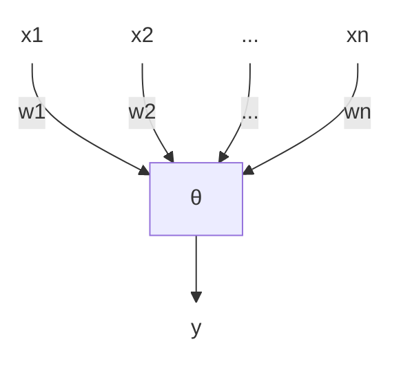

# 机器学习 复习

## 一 绪论

### 1.1 NFL（没有免费的午餐）定理

对于某一个学习算法$\mathcal{L_a}$，将$\mathcal{L_a}$对于问题$f$在训练集以外样本上的误差对于所有$f$求和，得到的结果与$\mathcal{L_a}$无关。

在**不关注要解决的问题**的前提下，**没有哪一种算法**比其他算法更好。

## 二 模型评估与选择

### 2.1 相关概念

- 经验误差
  - 在训练集上产生的误差
  - 太低会产生 **欠拟合**（特征学习不完全），太高会产生 **过拟合**（学习到不存在的特征）
- 测试误差
  - 在测试集上产生的误差
- 泛化误差
  - 在训练集以外的所有（将要接受的）样本上的误差
  - 应当被最小化

### 2.2 评估方法

对模型进行评估需要用于评估的 **测试集**。

选择测试集的常用方法：

- 留出法
  - 将原始数据集划分为两个互斥的子集
  - 多次随机划分，取平均作为最终评估结果。
  - **优点**
    - 简单
  - **缺点**
    - 可能因为划分方法不同导致结果差异较大
    - 数据集较小时，训练集数据可能不足。
- 交叉验证法
  - 将原始数据集划分为`k`个相等大小的折`(fold)`.
  - 将以下过程进行`k`次：
    - 第`i`次选择除了第`i`折以外的所有折作为训练集，第`i`折作为测试集。
  - 将`k`次评估结果的平均作为最终的评估结果。
  - 重复`m`次，取平均作为最终评估结果。
  - **优点**
    - 减少了随机性对于评估的影响（相对于留出法）。
    - 能够更充分利用数据（适用于数据集较小的情况）。
  - **缺点**
    - 计算开销较大。
    - 不适用于不平衡数据集。（折和折之间的样本类别比例可能不同）
- 自助法
  - 从原始数据集中 **有放回的** 抽取`n`个样本，作为训练集。
  - 未被抽到的样本作为测试集。
  - 重复`m`次，取平均作为最终评估结果。
  - 测试集中，**大约`1/3`（`1 / e`）的样本未在训练集中出现过**。
  - 适用于**集成学习**。
  - **优点**
    - 适用于数据集较小的情况。
    - 减少了随机性的影响。
  - **缺点**
    - 计算开销较大。
    - 生成的数据集中可能包含重复样本，导致过拟合。

### 2.3 性能度量

- 回归问题
  - 平均绝对误差（MAE）
  - 均方误差（MSE）
  - 均方根误差（RMSE）
  - R2
- 分类问题
  - 错误率（Error Rate）
    - 被错分的样本占样本总数的比例
  - 准确率（Accuracy）
    - 所有样本被正确分类的比例
    - `(TP + TN) / (N)`
  - 精确率（Precision）/ 查准率
    - 在被分类为正面的样本中，真正为正面样本的比例
    - `TP / (TP + FP)`
  - 召回率（Recall） / 真正例率（TPR） / 查全率
    - 被正确分类的**正面样本**占**全部正面样本**的比例
    - `TP / TP + FN`
  - 假正例率（FPR）
    - 被错误分类为正面的**负面样本**占**全部负面样本**的比例
    - `FP / FP + TN`
  - P-R曲线
    - 以召回率（查全率）为横轴，精确率（查准率）为纵轴，将每个样本作为正例进行预测，绘制出的曲线。
    - 在PR图中，某个分类器的曲线在另一个分类器之上，意味着该分类的表现优于另一个分类器。
    - 平衡点：PR曲线上查准率和查全率相等时的点。
      - 当P-R曲线存在交点时，平衡点也能够用来衡量分类器的表现。
  - F1
    - `F1 = 2 * (P * R) / (P + R)`; 其中P, R分别为精确率、召回率。
  - ROC
    - 以 **假正例率(FP)** 作为横轴， **真正例率(TP)** 作为纵轴，将每个样本作为正例进行预测，绘制出的曲线。
    - 如果某个学习器的ROC曲线覆盖了另一个学习器，则该学习器的表现优于另一个学习器。
  - AUC
    - ROC曲线下的面积
    - 当两条ROC曲线存在交点时，可用来衡量两个学习器的相对表现。

:::info 宏 / 微查全（准）率

- 微查全率 / 微查准率： 在 某一次训练 / 测试中所得到的查全率 / 查准率
- 微F1： 从微查全率 / 微查准率所计算得出的F1指标
- 宏查全率 / 宏查准率： 所有测试的微查全率 / 微查准率的平均
- 宏F1： 从宏查全率 / 宏查准率所计算出的F1指标

:::

:::info 代价曲线

代价曲线是不同类型的错误拥有不相等的代价时使用的度量手段。

代价曲线是以正例概率代价(实际代价 / 最大代价)为横轴，归一化代价(代价的期望 / 最大代价的期望)为纵轴的曲线。

代价曲线的绘制方法：

> 对于ROC曲线上的每一个点，在代价曲线上绘制一条`(0, FPR) -> (1, FNR)`的线段。
>
> 取所有线段的下界即为代价曲线。

:::

### 2.4 比较检验

我们在测试集上取得测试结果后，并不能直接将测试结果作为比较学习器的依据:

- 测试集的性能不等于泛化性能。
- 很多机器学习算法具有随机性。
- 测试性能随着测试集的变化而变化。

因此，我们需要 **假设检验**。

#### 交叉验证t检验

交叉验证t检验用于对比 **两个** 学习器的性能。

过程：

- 对两个学习器进行k折交叉验证。
- 计算两个模型的结果差异。
- 对结果差异进行t检验，计算结果是否显著。

问题：由于采用了交叉验证，因此测试的错误率并不独立；通常采用 **5×2交叉验证** 以解决这个问题。

#### 5×2交叉验证

*TODO

#### McNemar检验

McNemar检验用于判断两个分类器在同一数据集上的分类一致性。

#### Friedman检验

Friedman检验用于比较多个学习器的性能。

#### Nemenyi后续检验

当“所有算法的性能相同”假设被拒绝，则可以采用Nemenyi后续检验来进一步比较不同算法的表现差异。

### 2.5 偏差、方差

对于回归任务，我们通常使用偏差-方差分解来衡量 **泛化误差**。

$$
\begin{aligned}
  E(f; D) = bias^2(x) + var(x) + \epsilon^2(x)
\end{aligned}
$$

- 偏差（bias）
  - 模型对于数据的拟合程度
  - 偏差越大，模型越不拟合数据
  - 较大的偏差说明模型可能过于简单
  - 表达了模型本身的学习能力
- 方差（variance）
  - 模型对于不同数据的拟合程度
  - 方差越大，模型越不稳定
  - 表示了数据扰动所造成的影响
- 噪音（$\epsilon$项）
  - 表示在当前问题上，任意算法所能达到的泛化误差的期望下界
  - 表达了学习任务本身的难度

在一般的训练过程中，随着训练的进行，模型的泛化误差逐渐从偏差主导转变为方差主导。

## 三 线性模型

线性模型试图学习一个通过属性的线性组合来描述的函数。

也可以通过引入层级结构 / 将高维数据映射到低维空间来用线性模型学习非线性函数。

### 3.1 线性回归

线性回归试图学习一个线性模型$\bold{y} = \bold{\omega}\bold{x} + \bold{b}$，来更好的模拟实值的输出标记。

> 如何处理离散特征？
>
> - 将有序的特征连续化
> - 将无序的特征转换为`n`维变量

使用 **最小二乘法** 进行误差估计。

$$
\begin{aligned}
  (w*, b*) = \argmin_{(w, b)} \sum_{i=1}^n (y_i - (w \cdot x_i + b))^2
\end{aligned}
$$

进一步的，有 **广义线性模型**：

$$
\begin{aligned}
  \bold{y} = g^{-1}(\bold{\omega}\bold{x} + \bold{b})
\end{aligned}
$$

其中，$g^{-1}$为单调可微函数，称为“**联系函数**”。

::: info 对数几率回归

对数几率回归是一种 **二分类学习算法** 。

它使用Sigmoid函数$\sigma(x) = \frac{1}{1 + e^{-x}}$作为联系函数，从而将对数线性模型的任意实数值输出映射到一个$[0, 1]$的概率值，从而实现分类。

假设有

$$
\begin{align}
  \ln z &= \bold{\omega}\bold{x} + \bold{b}
\end{align}
$$

将$\sigma(·)$作为$g^{-1}$代入上式，则有

$$
\begin{aligned}
  y &= \frac{1}{1 + e^{-(\bold{\omega}^T\bold{x} + b)}} \\
  \ln\frac{y}{1 - y} &= \bold{\omega}\bold{x} + \bold{b}
\end{aligned}
$$

我们定义$\frac{y}{1 - y}$为 **几率**，它反映了$\bold{x}$作为正例的 **相对可能性**。

在对数几率回归中，我们假设某样本$\bold{x_i}$属于某一类的几率为$\sigma(z_i)$，属于另一类的几率为$1 - \sigma(z_i)$.

这种方法的优点在于：

- 无需假设数据分布
- 可以直接应用现有的数值优化算法取得最优解

TODO: 极大似然法

:::

:::info 多变量线性回归

假设有$n$个样本，每个样本有$d$个特征。

假设样本矩阵为$(\bold{x_1}; \bold{x_2}; \cdots; \bold{x_n})$，标记向量为$(y_1, y_2, \dots, y_n)$，权重向量$\bold{ \hat{\omega} } = (\omega_1, \omega_2, \dots, \omega_d, b)$.

利用 **最小二乘法** 进行估计。

有矩阵

$$

\bold{X} = 

\begin{bmatrix}
  x_{11} & x_{12} & \cdots & x_{1d}  & 1\\
  x_{21} & x_{22} & \cdots & x_{2d}  & 1\\
  \vdots & \vdots & \ddots & \vdots & \vdots\\
  x_{n1} & x_{n2} & \cdots & x_{nd} & 1
\end{bmatrix}
$$

有

$$
\bold{\hat{\omega}}^* = \argmin_{\hat{\omega}}(\bold{y} - \bold{X}\hat{\omega})^T(\bold{y} - \bold{X}\hat{\omega})
$$

对$\hat{\omega}$求导得，

$$
\begin{aligned}
  \frac{\partial}{\partial \hat{\omega}}(\bold{y} - \bold{X}\hat{\omega})^T(\bold{y} - \bold{X}\hat{\omega}) &= -2\bold{X}^T(\bold{y} - \bold{X}\hat{\omega})\\
\end{aligned}
$$

当$\bold{X}$为满秩时，解得

$$
\begin{aligned}
  \hat{\omega}^* = (\bold{X}^T\bold{X})^{-1}\bold{X}^T\bold{y}
\end{aligned}
$$

当$\bold{X}$不为满秩时，则$\bold{X}^T\bold{X}$不可逆，此时根据归纳偏好选择解 / 引入正则化项。

:::

### 3.2 二分类任务

#### 线性判别分析 (Linear Discriminant Analysis)

线性判别分析主要用于分类和降维任务。

线性判别分析的目标是 **找到一个线性投影，使得不同类别的数据在投影后的空间上尽可能分开，同类别的数据在投影后的空间上尽可能聚集。**

给定数据集$D = \set{(\bold{x_i}, y_i)}^{m}_{i = 1}, y_i \in \set{0, 1}$, 令$X_i, \bold{\mu_i}, \bold{\Sigma_i}$表示第$i \in \set{0, 1}$类的集合、均值向量、协方差矩阵（$n$个随机变量之间两两的协方差形成的矩阵）。

假设我们要将数据投影至直线$\bold{\omega}$上，则两类样本的协方差分别为$\bold{\omega}^T\bold{\Sigma_0}\bold{\omega}$和$\bold{\omega}^T\bold{\Sigma_1}\bold{\omega}$, 两类样本投影后的中心点分别为$\bold{\omega}^T\mu_0$和$\bold{\omega}^T\mu_1$.

要满足线性判分析的要求，则需要让

$$
\begin{aligned}
  \bold{\omega}^T\Sigma_0\bold{\omega} + \bold{\omega}^T\Sigma_1\bold{\omega}
\end{aligned}
$$
最小，让
$$
\begin{aligned}
  \|\bold{\omega}^T\bold{\mu_0} - \bold{\omega}^T\bold{\mu_1}\|^2_2
\end{aligned}

$$
最大。

则可得最大化的目标

$$
\begin{aligned}
  \bold{J} &= \frac{ {\|\bold{\omega}^T\bold{\mu_0} - \bold{\omega}^T\bold{\mu_1}\|^2_2}}{\bold{\omega}^T(\Sigma_0 + \Sigma_1)\bold{\omega} + \bold{\omega}^T\Sigma_1\bold{\omega}} \\
  &= \frac{\bold{\omega}^T(\bold{\mu_0 - \bold{\mu_1})(\bold{\mu_0} - \bold{\mu_1})^T\bold{\omega}}}{\bold{\omega}^T(\Sigma_0 + \Sigma_1)\bold{\omega}} \\
\end{aligned}
$$

TODO: 广义瑞利商

### 3.3 多分类任务

解决多分类问题常用的方法是

- 将二分类方法推广到多类
- 将问题进行拆分，拆分为多个二分类问题

其中，问题拆分又分为三种策略：

- 一对一（OvO）
- 一对其他（OvR）
- 多对多（MvM）

#### 一对一分类策略

将$N$类的分类任务拆分为$\frac{N(N - 1)}{2}$个二分类任务，共计$\frac{N(N - 1)}{2}$个分类器。

在预测过程中，将新样本提供给所有分类器进行预测并投票；取票数最多的类别作为最终预测结果。

**优点**：训练所需时间较短（每个分类器训练只需要两类的训练数据）

**缺点**：所需存储空间较大；预测时间较长（每个分类器都需要进行预测）

#### 一对其他分类策略

分别将每一类作为正类，其余类作为反类构建$N$个二分类分类器。

在预测过程中，将新样本提供给所有分类器进行预测，取 **置信度** 最高的预测结果作为最终的预测结果。

**优点**：存储空间较小；预测时间较短

**缺点**：训练所需时间较长（每个分类器都需要训练$N$类的训练数据）

#### 多对多分类策略

多对多分类常常将所有样本类做$M$次划分，每次划分将 **一部分类别划为正类， 一部分类别划为反类**，来训练$M$个二分类器。

一种常用的多对多分类策略为 **纠错输出码（ECOC）**。

纠错输出码将原本数据中的每一个类别与一串长为$M$的序列相对应（如类别$C_1$分别在分类器$f_1, f_2, \dots, f_5$中被划分为`1, -1, -1, 1, 1`， 则类别$C_1$在该分类策略下的输出码为 `[1 -1 -1 1 1]`）。

在预测时，将新样本交给$M$个分类器进行预测，得到新样本的输出码并分别和每一类的输出码计算距离；取 **距离最小的** 类别作为最预测输出。

### 3.4 类别不平衡问题

在线性回归中，我们通过$\frac{y}{1 - y}$的值来判断样本属于正类还是负类。

这个方法本质上是在判断$\frac{y}{1 - y}$和$1$的关系，这隐含了一个前提，即 **两类样本数量相等**。但这个方法在类别不平衡时并不适用。

假设训练集中有$m^+$个正例，$m^-$个负例，则应当在$\frac{y}{1 - y} > \frac{m^+}{m^-}$时判断为正例，$\frac{y}{1 - y} < \frac{m^+}{m^-}$时判断为负例。

具体的，我们通过构造$\frac{y'}{1 - y'} = \frac{y}{1 - y} \cdot \frac{m^-}{m^+}$来解决这个问题，也就是 **再缩放**。

常见的类别不平衡学习方法：

- 过采样
  - 通过增加一些正例来使得正反例数量接近
  - 例：SMOTE
    - 对于少数类中每一个样本`x`，选择`k`个最近邻，在该样本与最近邻的连线上随机取一点作为新的样本，来达成`k`倍过采样的目的。
- 欠采样
  - 去除一些反例使得正反例数量接近
- 阈值移动

### 3.* 优化提要

在各个任务下各个模型优化的目标和方法：

- 最小二乘法
  - 最小化均方误差
  - 使用 **线性代数**
- 对数几率回归
  - 最大化样本分布似然
  - 使用凸优化、梯度下降、牛顿法
- 线性判别分析
  - 最大化类间距离，最小化类内距离
  - 使用矩阵论、广义瑞利商

## 四 决策树

### 4.1 决策树的基本流程

决策树由一系列节点构成：

- 每个非叶子节点都对某一个特征进行测试，并根据测试结果将当前节点的样本划分为多个类。
- 每个叶子节点都代表着一种预测结果。

算法流程：

- 对于当前节点进行判断：
  - 当前节点包含的样本全部都是同一类`C`的样本 => 将当前节点标记为`C`类叶子节点并返回
  - 当前属性集为空 / 所有样本在所有属性上取值相同 => 将当前节点标记为众数类叶子节点并返回
  - 若不属于上述两种情况 => 继续算法
- **根据划分选择算法，从属性集`A`中选择一个最优划分属性`a`**。 <== *决策树算法的核心*
- 对于`a`的每一种取值`a'`，为当前节点生成一个分支，并将当前节点包含的样本中所有在属性`a`上取值为`a'`的样本划分到该分支下；
  - 若分支下的样本集为空 => 将该分支标记为 **当前节点中样本最多的类** 的叶子节点并返回。
- 对于每一个非叶子分支，递归调用算法。

### 4.2 划分选择

一般来说，我们希望随着划分过程，决策树分支节点随包含的样本尽可能属于同一类别（即 纯度升高）。

常用的划分选择方法有：

- 信息增益
- 增益率
- 基尼指数

#### 信息增益

**信息熵** 是度量样本集合纯度的最常用指标。

假设当前样本集合`D`中第`k`类样本占比为`p_k`，则`D`的信息熵定义为

$$
\begin{aligned}
  Ent(D) = -\sum_{k = 1}^{n} p_k \log_{2} p_k
\end{aligned}
$$

- $Ent(D)$越小，则$D$的纯度越高。
- $Ent(D)$的最小值为$0$，最大值为$\log_2 n$.

以属性`a`对数据集`D`进行划分所获得的信息增益为

$$
\begin{aligned}
  Gain(D, a) = Ent(D) - \sum_{v \in \set{a}} \frac{|D_v|}{|D|} Ent(D_v)
\end{aligned}
$$

即，增益等于划分前的信息熵与划分后的信息熵的差值；信息增益越大，说明数据集`D`用属性`a`划分获得的纯度提升越大。

式中$\frac{|D_v|}{|D|}$表示第$v$个分支的权重。

:::info 信息增益算法存在的问题

信息增益算法更偏好 **可取值数目较多的属性**，间接导致了决策树泛化能力的下降（例，将编号也作为一个划分属性，则会导致该属性贡献的信息熵远大于其他属性）

:::

#### 增益率

$$
\begin{align}
  Gain\_ratio(D, a) &= \frac{Gain(D, a)}{IV(a)}\\
  IV(a) &= -\sum_{v \in \set{a}} \frac{|D_v|}{|D|} \log_2 \frac{|D_v|}{|D|}
\end{align}
$$

属性`a`的可取值数量越多，则`IV(a)`的值通常也就越大。

主要思想：先从候选属性中找出信息增益高于平均水平的，再从中选取增益率最高的。

#### 基尼指数

$$
\begin{aligned}
  Gini(D) &= \sum_{k = 1}^{n} \sum_{k' \neq k} p_kp_{k'}\\
  &= 1 - \sum_{k = 1}^{n} p_k^2\\
  Gini_index(D, a) &= \sum_{v \in \set{a}} \frac{|D_v|}{|D|} Gini(D_v)
\end{aligned}
$$
其中， $Gini(D)$反映了从$D$中随机抽取两个样例，它们的类别不一致的概率；该值越小，$D$的纯度越高。

在属性选择的过程中，选择使划分后基尼指数最小的属性。

$$
\begin{aligned}
  a_* = \argmin_{a \in A} Gini_index(D, a)
\end{aligned}
$$

### 4.3 决策树剪枝

研究表明划分选择**对于泛化性能的影响有限**；剪枝方法和程度对于决策树泛化性能的影响更为显著。（决策树剪枝可以有效防止决策树发生过拟合。）

剪枝存在两种基本策略：

- 预剪枝：提前终止某些分支的生长。
- 后剪枝：生成完整的树后再进行剪枝。

#### 预剪枝

在决策树生成过程中，对于每个节点，**在划分之前先进行估计**：

- 若当前节点的划分不能带来泛化性能的提升，则停止划分，将当前节点标记为叶子节点，类别设为训练样例数最多的类别。
  - 具体的，将划分前后的决策树在验证集上进行测试，并比较准确率。

优点：

- 降低过拟合风险
- 减少训练时间和训练开销

缺点：

- 存在 **欠拟合风险**
  - 某些分支可能本身的划分不能带来泛化性能的提升，但可能基于该分支的后续划分却能带来性能的显著提高。

#### 后剪枝

先生成完整的决策树，然后自底向上地对非叶子节点进行考察：

- 若将某个非叶子节点标记为叶子节点，其泛化性能提升，则将其标记为叶子节点。

优点：保留了更多的分支，欠拟合风险较小，泛化能力通常高于预剪枝。

缺点：训练时间长，开销较大。

### 4.4 连续和缺失值

- 连续值
  - 连续属性一般采用离散化的方式处理。
  - 常见方法：二分法
    - 若连续属性存在$n$个候选取值$a_1, a_2, \dots, a_n$，则可将$\frac{a_i + a_{i + 1}}{2}$作为候选划分点。
    - 由此可以得出$n$个划分区间，可以当作$n$个离散变量进行处理。

在生成划分点之后，使用离散属性值的方法(信息增益、基尼系数等)对这些划分点进行考察，以选择一个划分点。

#### 缺失值处理

缺失值处理需要解决两个问题：

- 划分属性的选择
- 划分属性上的缺失值处理

假定有训练集$D$和属性$a$，属性$a$有$V$个可能的取值。

假设$\tilde{D}$表示$D$中在属性$a$上没有缺失值的样本子集，$\tilde{D}_v$表示$\tilde{D}$中在属性$a$上取值为$v$的样本子集, $\tilde{D}_k$为$D$中属于第$k$类的样本子集。

显然，我们只能根据$\tilde{D}$来决定属性$a$的好坏。

假设我们为任意一个样本$x$都赋予了一个权重$\omega_x$.

定义以下属性：

- $\rho = \frac{\sum_{x \in \tilde{D}}\omega_x}{\sum_{x \in D} \omega_x}$: 样本中 **不含缺失值的部分** 所占的比例。
- $\tilde{p}_k = \frac{\sum_{x \in \tilde{D}_k}\omega_x}{\sum_{x \in \tilde{D}} \omega_x}$: 样本不含缺失值的部分中 **第$k$类所占的比例**。
- $\tilde{r}_v = \frac{\sum_{x \in \tilde{D}_v}\omega_x}{\sum_{x \in \tilde{D}} \omega_x}$: 样本不含缺失值的部分中 **取值为$v$的样本所占的比例**。

则信息增益可以推广为

$$
\begin{aligned}
  Gain(D, a) &= \rho \times Gain(\tilde{D}, a)\\
  &= \rho \times \left(\text{Ent}\left(\tilde{D}\right) - \sum_{v = 1}^{V}\tilde{r}_v\text{Ent}\left(\tilde{D}^v\right)\right).
\end{aligned}
$$

其中，

$$
\begin{aligned}
  \text{Ent}\left(\tilde{D}\right) = -\sum_{k = 1}^{n} \tilde{p}_k \log_2 \tilde{p}_k
\end{aligned}
$$

对于具体样本的分配：

- 若样本$x$在属性$a$上的取值已知，则将$x$划入对应的子节点。
- 若$x$在属性$a$上没有取值，则将$x$同时分配至所有子结点中，并将其在对应的子节点中的权重调整为$\tilde{r}_v \cdot \omega_x$. （相当于按照权重划分）

### 4.5 多变量决策树

对于多变量决策树来说，每个非叶子节点不再是对于一个属性进行判断，而是对 **多个属性的线性组合** 进行判断。

## 五 神经网络

神经网络是由具有适应性的简单单元组成的、广泛并行互联的网络；
它的组织能够模拟生物神经系统对真实世界物体所做出的交互反应。

### 5.1 神经元模型

本单元讨论`M-P`神经元模型。

其中, 

- $x_1, x_2, \dots, x_n$是神经元的输入；
- $w_1, w_2, \dots, w_n$是每个输入对应的连接权重；
- $\theta$是神经元的输出阈值；
- $f$是神经元的激活函数；
- $y$是神经元的输出。

对于该神经元，有公式

$$
\begin{aligned}
  y = f\left(\sum_{i = 1}^{n}x_iw_i - \theta\right)
\end{aligned}
$$

:::info 神经元的激活函数

神经元的激活函数决定了神经元是否被激活、被激活到什么程度。

它的作用有：

- 在计算中引入非线性，使得神经网络能够学习和表示复杂的非线性关系。
- 决定神经元的输出（映射输入到输出）。

常见的激活函数有：

- 阶跃函数：$f(x) = \text{sign}(x)$.
  - 理想的激活函数；
  - 数学性质并不好，因此实践中用其他函数代替。
- Sigmoid函数：$f(x) = \frac{1}{1 + e^{-x}}$.
  - 将任意实数输入映射至$(0, 1)$区间内。
  - 适用于二分类任务，但可能导致梯度消失。
- Tanh函数：$f(x) = \frac{e^x - e^{-x}}{e^x + e^{-x}}$.
  - 将任意实数输入映射至$(-1, 1)$区间内。
  - 仍然存在梯度消失问题。
- ReLU函数：$f(x) = \max(x, 0)$.
  - 将任意实数输入映射至$[0, +\infty)$区间内。
  - 计算简单且能缓解梯度消失问题。
  - 存在神经元死亡问题。
- Leaky ReLU函数：$f(x) = \max(x, \alpha x)$.
  - 在ReLU函数的基础上，引入了负数输入的线性部分。
  - 解决了神经元死亡问题。

:::

### 5.2 感知机、多层网络

#### 感知机

感知机由两层神经元组成，**输入层** 和 **输出层**。

输入层接受外界输入信号传递给输出层，输出层是`M-P`
神经元。

::: info 感知机的学习规则

对于训练样例$(\bold{x}, y)$, 若感知机的输出为$\hat{y}$，则感知机的权重调整规则为

$$
\begin{aligned}
  w_i &\leftarrow w_i +\Delta w_i\\
  \Delta w_i &= \eta(y - \hat{y})x_i
\end{aligned}
$$

其中$\eta$为 **学习率**。

:::

若要学习的两类模式 **线性可分**， 则感知机的学习过程一定会收敛；

反之，感知机的学习过程将发生震荡。

#### 多层网络（多层感知机）

多层感知机在输入层和输出层之间加入了多层 **隐层**；隐层和输出层中的神经元都是具有激活函数的功能神经元。

其中，不存在同层连接、跨层连接的多层网络称为 **多层前馈网络**。

理论上，只需要一个包含足够多神经元的隐层，多层前馈网络就能以任意精度逼近任意复杂度的连续函数；但如何设置隐层的神经元数量目前没有通用解。

### 5.3 反向传播算法 (BP)

假设如下：

- 训练集：$D = \set{(x_1, y_1), (x_2, y_2), \dots, (x_m, y_m)}$.
- 输入：$d$维特征向量
- 输出：$l$个输出值
- 隐层：宽度为$q$，且均使用`Sigmoid`激活函数

对于训练例$(x_k, y_k)$, 假设实际输出为$\hat{y}_k = (\hat{y}_1^k, \hat{y}_2^k, \dots, \hat{y}_l^k)$, 则该网络在$(x_k, y_k)$上的均方误差为:

$$
\begin{aligned}
  E_k &= \frac{1}{2}\sum_{j = 1}^{l}(\hat{y}_j^k - y_j^k)^2
\end{aligned}
$$

可知，需要通过学习来确定$(d + l + 1)q + l$个参数。

假设隐层的第$i$个节点到输出层的第$j$个节点的权重为$w_{ij}$, 输入层的第$i$个节点到隐层的第$j$个节点的权重为$v_{ij}$.

假设输出层的第$i$个节点的输入为$\beta_i$, 隐层的第$i$个节点的输入为$\alpha_i$，阈值为$b_i$.

对于误差$E_k$，给定学习率$\eta$，有（链式法则）

$$
\begin{aligned}
  \Delta w_{ij}^k &= -\eta\frac{\partial E_k}{\partial w_{ij}}\\
  &= -\eta \cdot \frac{\partial E_k}{\partial \hat{y}_j^k} \cdot \frac{\partial \hat{y}_j^k}{\partial \beta_j} \cdot \frac{\partial \beta_j}{\partial w_{ij}}\\
  &= -\eta \cdot (\hat{y}_j^k - y_j^k) \cdot \hat{y}_j^k(1 - \hat{y}_j^k) \cdot b_i
\end{aligned}
$$

令$g_j = - \frac{\partial E_k}{\partial \hat{y}_j^k} \cdot \frac{\partial \hat{y}_j^k}{\partial \beta_j}$, 则有

$$
\begin{aligned}
  \Delta w_{ij}^k &= \eta g_j \cdot b_i
\end{aligned}
$$

类似的，有

$$
\begin{aligned}
  \Delta \theta_j &= -\eta g_j\\
  \Delta v_ih &= \eta e_hx_i\\
  \Delta \gamma_h &= -\eta e_h
\end{aligned}
$$

其中，

$$
\begin{aligned}
  e_h &= -\frac{\partial E_k}{\partial b_h} \cdot \frac{\partial b_h}{\partial \alpha_{h}}\\
  &= b_h(1 - b_h)\sum_{j = 1}^{l}g_jw_{hj}
\end{aligned}
$$

:::info 标准BP / 累积BP

| 标准BP                           | 累积BP                             |
| -------------------------------- | ---------------------------------- |
| 每次对单个训练样例更新阈值和权值 | 读取完整个训练集一次才更新参数     |
| 适用于累计误差下降到一定水平后   | 适用于最小化整个训练集上的累计误差 |

:::

:::info 缓解多层前馈网络的过拟合现象

主要有两种缓解多层前馈网络过拟合现象的策略：

- 提前停止
  - 若连续`a`轮训练的误差变化都小于`b`，则停止训练。
  - 使用验证集：当训练集误差降低，验证集误差升高时停止训练。
- 正则化
  - 在误差函数中增加一项描述网络复杂度的表达式
  - 例：
  $$
  \begin{aligned}
    E = \lambda\frac{1}{m}\sum_{k = 1}^{m}E_k + (1 - \lambda)\sum_{i}w_i^2
  \end{aligned}
  $$
  - $\lambda$为正则化系数，$w_i$为网络中的权重。该表达式会使得训练更偏好较小的连接权重和阈值，网络输出更“光滑”。

:::

### 5.4 全局最小、局部最小

神经网络的训练过程可被看作是一个寻找全局最优（参数空间中）的过程；因此在训练中，神经网络很可能陷入局部极小值而导致无法进一步优化模型。

避免局部最小的常见策略：

- 使用不同的初始参数进行训练
- 使用模拟退火算法
- 对参数进行随机扰动
- 使用演化算法
- ...

### 5.5 其他常见神经网络

- RBF（径向基）函数网络
  - 单隐层
  - 使用径向基函数作为神经元激活函数
  - 输出是隐层输出的线性组合
  - 适用于 **多分类问题**
- ART（自适应谐振）网络
  - 采用竞争学习：网络的输出神经元之间 **互相竞争**，每个时间刻只有一个输出神经元被激活，其他神经元被抑制。
  - 由比较层、识别层、识别阈值、重置模块构成。
  - 性能依赖于识别阈值（高->分类细，低->分类粗）
  - 可用于在线学习（持续学习新数据）
  - 适用于 **模式识别**
- SOM（自组织特征映射）网络
  - 竞争型的无监督神经网络
  - 将高维数据映射到低维（二维）空间；将高维空间中相似的样本点映射到输出层中的临近神经元。
  - 适用于数据可视化、聚类分析等。
- CC（级联相关）网络
  - 构造性神经网络：**将网络的结构也当作是学习的目标之一**；
  - 需要在训练过程中找到适合数据的网络结构。
  - 开始时只有输入和输出层，随着训练逐渐加入隐层节点。
- Hopfield网络
  - 反馈型神经网络
  - 主要用于存储和检索记忆。
- Elman网络
  - 递归神经网络
- Boltzmann机
  - 能量模型
  - 采用布尔型神经元（只有激活/抑制状态）

### 5.6 深度学习

略

## 六 支持向量机

### 6.1 间隔、支持向量

在线性分类器中，我们试图找到一个样本空间中的超平面，来将不同的两类样本分别分到平面两侧。

在诸多能够将训练样本分开的超平面中，一般“正中间”的那个超平面具有最强的鲁棒性 / 泛化能力。

因此，我们希望找到具有最大间隔的超平面。

假设超平面为$w^Tx + b = 0$，则样本点$\bold{x}$到超平面的距离$r$为：

$$
\begin{aligned}
  r = \frac{|w^Tx + b|}{\|w\|}
\end{aligned}
$$

假设样本的标签分别为$1$和$-1$，则样本点被正确分类的条件为

$$
\begin{aligned}
  \begin{cases}
    w^Tx + b \geq 1 & \text{if } y = 1\\
    w^Tx + b \leq -1 & \text{if } y = -1
  \end{cases}
\end{aligned}
$$

（代入超平面表达式得到的取值足以被分类为某类样本）

使得上述不等式成立的、距离超平面最近的几个样本点被称为**支持向量**。

其中，$w^Tx + b = 1$和$w^Tx + b = -1$为距离原超平面$\frac{1}{\|w\|}$的两个超平面，称为 **最大间隔边界**；位于最大间隔边界上的向量称为 **支持向量**.

记两侧的样本到超平面的最小距离之和为$\gamma$，有公式

$$
\gamma = \frac{2}{\|w\|}
$$

我们的任务是寻找使得$\gamma$最大的参数$w$和$b$，即

$$
\begin{aligned}
  &\max_{w, b}\frac{2}{\|w\|}\\
  &\text{s.t.} \quad y_i(w^Tx_i + b) \geq 1, i = 1, 2, \cdots, m
\end{aligned}
$$

最大化$\|w\|^{-1}$等效于最小化$\|w\|^2$；于是上式可重写为

$$
\begin{aligned}
  &\min_{w, b}\frac{1}{2}\|w\|^2\\
  &\text{s.t.} \quad y_i(w^Tx_i + b) \geq 1, i = 1, 2, \cdots, m
\end{aligned}
$$

这就是SVM问题的基本型。

### 6.2 对偶问题

对SVM问题的基本型添加拉格朗日乘子，得到拉格朗日函数：

$$
\begin{align}
  L(w, b, \bold{\alpha}) = \frac{1}{2}\|w\|^2 + \sum_{i = 1}^{m}\alpha_i[1 - y_i(w^Tx_i + b)]
\end{align}
$$

其中$\alpha_i \geq 0$为拉格朗日乘子。

上述过程中应用了 **KKT条件**。

:::info **KKT条件**

KKT条件用于处理约束是不等式时的情况。

以上式为例，KKT条件共包括三个：

- **拉格朗日乘子条件**：$\alpha_i \geq 0$
- **互补松弛条件**：$\alpha_i[1 - y_i(w^Tx_i + b)] = 0$
- **约束条件**：$y_i(w^Tx_i + b) \geq 1$
- **梯度条件**：$\frac{\partial L}{\partial w} = 0, \frac{\partial L}{\partial b} = 0$.

:::

由梯度条件可得，

$$
\begin{align}
  w &= \sum_{i = 1}^{m}\alpha_iy_ix_i\\
  0 &= \sum_{i = 1}^{m}\alpha_iy_i
\end{align}
$$

将$(5)$代入$(4)$，即可消去$w, b$；再代入$(6)$，即可得到SVM原始问题的对偶问题

$$
\begin{aligned}
  &\max_{\alpha} \sum_{i = 1}^{m}\alpha_i - \frac{1}{2}\sum_{i = 1}^{m}\sum_{j = 1}^{m}\alpha_i\alpha_jy_iy_jx_i^Tx_j\\
  &\text{s.t.} \quad \sum_{i = 1}^{m}\alpha_iy_i = 0, \alpha_i \geq 0, i = 1, 2, \cdots, m
\end{aligned}
$$

解得$\alpha_i$后便可求出所需的$w$和$b$（解法后续介绍）：

$$
\begin{aligned}
  f(x) &= w^Tx + b\\
  &= \sum_{i = 1}^{m}\alpha_iy_ix_i^Tx + b
\end{aligned}
$$

回顾KKT条件：

$$
\begin{cases}
  \alpha_i \geq 0\\
  \alpha_i[y_if(x) - 1] = 0\\
  y_if(x) - 1 \geq 0
\end{cases}
$$

因为求得的所有解均满足上述条件，因此对于任意一个训练样本，都有$\alpha_i = 0$或$y_if(x) = 1$;

对于第一种情况，该样本将不会再出现在$f(x)$的表达式中，因此对于超平面的选择没有影响；

对于第二种情况，该样本位于最大间隔边界上，是一个 **支持向量**。

由此可见一个SVM的特殊性质:在训练完成后，绝大部分的训练样本都不会保留；最终的模型只和支持向量有关。

:::info SMO算法

SMO算法（Sequential Minimal Optimization）是求解对偶问题的算法。

SMO算法的基本思路：

1. 选择两个参数$a_i, a_j$并固定其他所有参数；
2. 求解对偶问题，得到$a_i, a_j$的新值；

研究发现，只要所选的$a_i, a_j$中至少有一个不满足KKT条件，目标函数就会在本次迭代之后减小;因此，SMO会先选择违背KKT条件程度最大的变量，再选取使得目标函数值减少最快的变量。

实践中，SMO采用启发式方法选择$a_i, a_j$：使得两个样本之间的间隔最大。

:::

### 6.3 核函数

支持向量机也可用于训练样本在原始样本空间内线性不可分的情况。

对于这种问题，可以将样本从原始空间映射到一个更高维的特征空间，使得样本在该空间内线性可分。

有结论：**如果原始空间维数有限（原始样本属性数量有限），则一定存在一个更高维的特征空间使得样本线性可分。**

令$\phi(\bold{x})$表示将$x$映射之后的特征向量，则在特征空间中划分训练样本的超平面为

$$
\begin{aligned}
  f(x) &= w^T\phi(x) + b\\
\end{aligned}
$$

类似的，其有对偶问题

$$
\begin{aligned}
  &\max_{\alpha} \sum_{i = 1}^{m}\alpha_i - \frac{1}{2}\sum_{i = 1}^{m}\sum_{j = 1}^{m}\alpha_i\alpha_jy_iy_j\phi(x_i)^T\phi(x_j)\\
  &\text{s.t.} \quad \sum_{i = 1}^{m}\alpha_iy_i = 0, \alpha_i \geq 0, i = 1, 2, \cdots, m
\end{aligned}
$$

实践中，计算$\phi(x)^T\phi(x)$通常很困难（映射后的空间通常维数相当大），因此可以假设函数$\kappa(x_i, x_j) = \phi(x_i)^T\phi(x_j)$。

则上式可以改写为

$$
\begin{aligned}
  &\max_{\alpha} \sum_{i = 1}^{m}\alpha_i - \frac{1}{2}\sum_{i = 1}^{m}\sum_{j = 1}^{m}\alpha_i\alpha_jy_iy_j\kappa(x_i, x_j)\\
  &\text{s.t.} \quad \sum_{i = 1}^{m}\alpha_iy_i = 0, \alpha_i \geq 0, i = 1, 2, \cdots, m
\end{aligned}
$$

求解后可得

$$
\begin{aligned}
  f(x) &= \sum_{i = 1}^{m}\alpha_iy_i\kappa(x_i, x) + b
\end{aligned}
$$

这里的$\kappa(\cdot, \cdot)$就是 **核函数**。

总而言之，核函数的引入可以让我们直接计算出样本在高维空间中的内积，而不用去计算高维向量的内积。

上式也称“支持向量展式”，代表着 **模型的最优解可以通过训练样本的核函数展开**。

:::info 核函数的存在定理

令$\mathcal{X}$为输入空间，$\kappa(\cdot, \cdot)$是定义在$\mathcal{X} \times \mathcal{X}$空间上的对称函数，则$\kappa$是核函数当且仅当对于任意数据集$\mathcal{D} = \{x_1, x_2, \cdots, x_m\}$，核矩阵$K$总是正定的。

$$
\begin{aligned}
  K = \begin{bmatrix}
    \kappa(x_1, x_1) & \kappa(x_1, x_2) & \cdots & \kappa(x_1, x_m)\\
    \kappa(x_2, x_1) & \kappa(x_2, x_2) & \cdots & \kappa(x_2, x_m)\\
    \vdots & \vdots & \ddots & \vdots\\
    \kappa(x_m, x_1) & \kappa(x_m, x_2) & \cdots & \kappa(x_m, x_m)
  \end{bmatrix}
\end{aligned}
$$

> 提示：一个矩阵$A$是半正定的，当且仅当对于任意非零实数向量$x$，有$xAx^T \geq 0$成立。

~~这鬼东西真能考吗？？？~~

:::

:::note 常用的核函数

- 线性核：$\kappa(x_i, x_j) = x_i^Tx_j$
- 多项式核：$\kappa(x_i, x_j) = (x_i^Tx_j)^d$, $d \geq 1$为多项式的次数
- 高斯核：$\kappa(x_i, x_j) = \exp(-\frac{\|x_i - x_j\|^2}{2\sigma^2})$, $\sigma > 0$为高斯核的带宽
- 拉普拉斯核：$\kappa(x_i, x_j) = \exp(-\frac{\|x_i - x_j\|}{\sigma})$, $\sigma > 0$
- Sigmoid核：$\kappa(x_i, x_j) = \tanh(\beta x_i^Tx_j + \theta)$, $\beta > 0, \theta < 0$

另有如下定理成立：

- 假设$\kappa_1, \kappa_2$均为核函数，则其线性组合$a\kappa_1 + b\kappa_2$也是核函数。
- 假设$\kappa_1, \kappa_2$均为核函数，则其直积$\kappa_1 \cdot \kappa_2$也是核函数。
- 假设$\kappa$是核函数，则对于任意函数$g(\cdot)$, $g(x)\kappa(x, z)g(z)$也是核函数。

:::

### 6.4 软间隔、正则化

在现实生活的问题中，常常难以找到一个超平面将样本彻底划分开来。为缓解这个问题，我们引入 **软间隔** 的概念——允许部分样本被错误分类。

在软间隔SVM中，允许部分样本并不满足SVM的约束（落在最大间隔边界之内）；当然，这样的样本需要尽可能少。

软间隔SVM的优化目标为

$$
\begin{aligned}
  \min_{w, b} \frac{1}{2}w^Tw + C\sum_{i = 1}^{m}l_{0/1}(y_i(w^Tx_i + b) - 1)
\end{aligned}
$$

其中$l_{0/1}$为“0/1损失函数”，定义如下：

$$
\begin{aligned}
  l_{0/1}(z) = \begin{cases}
    &1, \quad \text{if }z < 0;\\
    &0, \quad \text{otherwise}.
  \end{cases}
\end{aligned}
$$

从优化目标可以看出，当$C \to \infty$时，软间隔SVM退化为硬间隔SVM。

此外，0/1损失函数的数学性质不太好；因此实践中常用以下损失函数进行替换。

- hinge损失：$l_{hinge}(z) = \max(0, 1 - z)$
- 指数损失：$l_{exp}(z) = \exp(-z)$
- 对数损失：$l_{log}(z) = \log(1 + \exp(-z))$

采用`hinge`损失时，可将优化目标写成

$$
\min_{w, b} \frac{1}{2}w^Tw + C\sum_{i = 1}^{m}\max(0, 1 - y_i(w^Tx_i + b))
$$

当采用`hinge`损失，且引入 **松弛变量** $\xi_i \geq 0$, 则可将上式重写为

$$
\min_{w, b} \frac{1}{2}w^Tw + C\sum_{i = 1}^{m}\xi_i
$$

松弛变量$\xi_i$的定义如下（将原式进行移相）：

$$
\begin{aligned}
  &y_i(w^Tx_i + b) \geq 1 - \xi_i\\
  &\xi_i \geq 0, i = 1, 2, \dots, m.
\end{aligned}
$$

### 6.5 支持向量回归

### 6.6 核方法