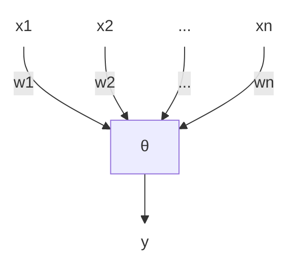

# 机器学习 复习

## 一 绪论

### 1.1 NFL（没有免费的午餐）定理

对于某一个学习算法$\mathcal{L_a}$，将$\mathcal{L_a}$对于问题$f$在训练集以外样本上的误差对于所有$f$求和，得到的结果与$\mathcal{L_a}$无关。

在**不关注要解决的问题**的前提下，**没有哪一种算法**比其他算法更好。

## 二 模型评估与选择

### 2.1 相关概念

- 经验误差
  - 在训练集上产生的误差
  - 太低会产生 **欠拟合**（特征学习不完全），太高会产生 **过拟合**（学习到不存在的特征）
- 测试误差
  - 在测试集上产生的误差
- 泛化误差
  - 在训练集以外的所有（将要接受的）样本上的误差
  - 应当被最小化

### 2.2 评估方法

对模型进行评估需要用于评估的 **测试集**。

选择测试集的常用方法：

- 留出法
  - 将原始数据集划分为两个互斥的子集
  - 多次随机划分，取平均作为最终评估结果。
  - **优点**
    - 简单
  - **缺点**
    - 可能因为划分方法不同导致结果差异较大
    - 数据集较小时，训练集数据可能不足。
- 交叉验证法
  - 将原始数据集划分为`k`个相等大小的折`(fold)`.
  - 将以下过程进行`k`次：
    - 第`i`次选择除了第`i`折以外的所有折作为训练集，第`i`折作为测试集。
  - 将`k`次评估结果的平均作为最终的评估结果。
  - 重复`m`次，取平均作为最终评估结果。
  - **优点**
    - 减少了随机性对于评估的影响（相对于留出法）。
    - 能够更充分利用数据（适用于数据集较小的情况）。
  - **缺点**
    - 计算开销较大。
    - 不适用于不平衡数据集。（折和折之间的样本类别比例可能不同）
- 自助法
  - 从原始数据集中 **有放回的** 抽取`n`个样本，作为训练集。
  - 未被抽到的样本作为测试集。
  - 重复`m`次，取平均作为最终评估结果。
  - 测试集中，**大约`1/3`（`1 / e`）的样本未在训练集中出现过**。
  - 适用于**集成学习**。
  - **优点**
    - 适用于数据集较小的情况。
    - 减少了随机性的影响。
  - **缺点**
    - 计算开销较大。
    - 生成的数据集中可能包含重复样本，导致过拟合。

### 2.3 性能度量

- 回归问题
  - 平均绝对误差（MAE）
  - 均方误差（MSE）
  - 均方根误差（RMSE）
  - R2
- 分类问题
  - 错误率（Error Rate）
    - 被错分的样本占样本总数的比例
  - 准确率（Accuracy）
    - 所有样本被正确分类的比例
    - `(TP + TN) / (N)`
  - 精确率（Precision）/ 查准率
    - 在被分类为正面的样本中，真正为正面样本的比例
    - `TP / (TP + FP)`
  - 召回率（Recall） / 真正例率（TPR） / 查全率
    - 被正确分类的**正面样本**占**全部正面样本**的比例
    - `TP / TP + FN`
  - 假正例率（FPR）
    - 被错误分类为正面的**负面样本**占**全部负面样本**的比例
    - `FP / FP + TN`
  - P-R曲线
    - 以召回率（查全率）为横轴，精确率（查准率）为纵轴，将每个样本作为正例进行预测，绘制出的曲线。
    - 在PR图中，某个分类器的曲线在另一个分类器之上，意味着该分类的表现优于另一个分类器。
    - 平衡点：PR曲线上查准率和查全率相等时的点。
      - 当P-R曲线存在交点时，平衡点也能够用来衡量分类器的表现。
  - F1
    - `F1 = 2 * (P * R) / (P + R)`; 其中P, R分别为精确率、召回率。
  - ROC
    - 以 **假正例率(FP)** 作为横轴， **真正例率(TP)** 作为纵轴，将每个样本作为正例进行预测，绘制出的曲线。
    - 如果某个学习器的ROC曲线覆盖了另一个学习器，则该学习器的表现优于另一个学习器。
  - AUC
    - ROC曲线下的面积
    - 当两条ROC曲线存在交点时，可用来衡量两个学习器的相对表现。

:::info 宏 / 微查全（准）率

- 微查全率 / 微查准率： 在 某一次训练 / 测试中所得到的查全率 / 查准率
- 微F1： 从微查全率 / 微查准率所计算得出的F1指标
- 宏查全率 / 宏查准率： 所有测试的微查全率 / 微查准率的平均
- 宏F1： 从宏查全率 / 宏查准率所计算出的F1指标

:::

:::info 代价曲线

代价曲线是不同类型的错误拥有不相等的代价时使用的度量手段。

代价曲线是以正例概率代价(实际代价 / 最大代价)为横轴，归一化代价(代价的期望 / 最大代价的期望)为纵轴的曲线。

代价曲线的绘制方法：

> 对于ROC曲线上的每一个点，在代价曲线上绘制一条`(0, FPR) -> (1, FNR)`的线段。
>
> 取所有线段的下界即为代价曲线。

:::

### 2.4 比较检验

我们在测试集上取得测试结果后，并不能直接将测试结果作为比较学习器的依据:

- 测试集的性能不等于泛化性能。
- 很多机器学习算法具有随机性。
- 测试性能随着测试集的变化而变化。

因此，我们需要 **假设检验**。

#### 交叉验证t检验

交叉验证t检验用于对比 **两个** 学习器的性能。

过程：

- 对两个学习器进行k折交叉验证。
- 计算两个模型的结果差异。
- 对结果差异进行t检验，计算结果是否显著。

问题：由于采用了交叉验证，因此测试的错误率并不独立；通常采用 **5×2交叉验证** 以解决这个问题。

#### 5×2交叉验证

*TODO

#### McNemar检验

McNemar检验用于判断两个分类器在同一数据集上的分类一致性。

#### Friedman检验

Friedman检验用于比较多个学习器的性能。

#### Nemenyi后续检验

当“所有算法的性能相同”假设被拒绝，则可以采用Nemenyi后续检验来进一步比较不同算法的表现差异。

### 2.5 偏差、方差

对于回归任务，我们通常使用偏差-方差分解来衡量 **泛化误差**。

$$
\begin{aligned}
  E(f; D) = bias^2(x) + var(x) + \epsilon^2(x)
\end{aligned}
$$

- 偏差（bias）
  - 模型对于数据的拟合程度
  - 偏差越大，模型越不拟合数据
  - 较大的偏差说明模型可能过于简单
  - 表达了模型本身的学习能力
- 方差（variance）
  - 模型对于不同数据的拟合程度
  - 方差越大，模型越不稳定
  - 表示了数据扰动所造成的影响
- 噪音（$\epsilon$项）
  - 表示在当前问题上，任意算法所能达到的泛化误差的期望下界
  - 表达了学习任务本身的难度

在一般的训练过程中，随着训练的进行，模型的泛化误差逐渐从偏差主导转变为方差主导。

## 三 线性模型

线性模型试图学习一个通过属性的线性组合来描述的函数。

也可以通过引入层级结构 / 将高维数据映射到低维空间来用线性模型学习非线性函数。

### 3.1 线性回归

线性回归试图学习一个线性模型$\bold{y} = \bold{\omega}\bold{x} + \bold{b}$，来更好的模拟实值的输出标记。

> 如何处理离散特征？
>
> - 将有序的特征连续化
> - 将无序的特征转换为`n`维变量

使用 **最小二乘法** 进行误差估计。

$$
\begin{aligned}
  (w*, b*) = \argmin_{(w, b)} \sum_{i=1}^n (y_i - (w \cdot x_i + b))^2
\end{aligned}
$$

进一步的，有 **广义线性模型**：

$$
\begin{aligned}
  \bold{y} = g^{-1}(\bold{\omega}\bold{x} + \bold{b})
\end{aligned}
$$

其中，$g^{-1}$为单调可微函数，称为“**联系函数**”。

::: info 对数几率回归

对数几率回归是一种 **二分类学习算法** 。

它使用Sigmoid函数$\sigma(x) = \frac{1}{1 + e^{-x}}$作为联系函数，从而将对数线性模型的任意实数值输出映射到一个$[0, 1]$的概率值，从而实现分类。

假设有

$$
\begin{align}
  \ln z &= \bold{\omega}\bold{x} + \bold{b}
\end{align}
$$

将$\sigma(·)$作为$g^{-1}$代入上式，则有

$$
\begin{aligned}
  y &= \frac{1}{1 + e^{-(\bold{\omega}^T\bold{x} + b)}} \\
  \ln\frac{y}{1 - y} &= \bold{\omega}\bold{x} + \bold{b}
\end{aligned}
$$

我们定义$\frac{y}{1 - y}$为 **几率**，它反映了$\bold{x}$作为正例的 **相对可能性**。

在对数几率回归中，我们假设某样本$\bold{x_i}$属于某一类的几率为$\sigma(z_i)$，属于另一类的几率为$1 - \sigma(z_i)$.

这种方法的优点在于：

- 无需假设数据分布
- 可以直接应用现有的数值优化算法取得最优解

TODO: 极大似然法

:::

:::info 多变量线性回归

假设有$n$个样本，每个样本有$d$个特征。

假设样本矩阵为$(\bold{x_1}; \bold{x_2}; \cdots; \bold{x_n})$，标记向量为$(y_1, y_2, \dots, y_n)$，权重向量$\bold{ \hat{\omega} } = (\omega_1, \omega_2, \dots, \omega_d, b)$.

利用 **最小二乘法** 进行估计。

有矩阵

$$

\bold{X} =

\begin{bmatrix}
  x_{11} & x_{12} & \cdots & x_{1d}  & 1\\
  x_{21} & x_{22} & \cdots & x_{2d}  & 1\\
  \vdots & \vdots & \ddots & \vdots & \vdots\\
  x_{n1} & x_{n2} & \cdots & x_{nd} & 1
\end{bmatrix}
$$

有

$$
\bold{\hat{\omega}}^* = \argmin_{\hat{\omega}}(\bold{y} - \bold{X}\hat{\omega})^T(\bold{y} - \bold{X}\hat{\omega})
$$

对$\hat{\omega}$求导得，

$$
\begin{aligned}
  \frac{\partial}{\partial \hat{\omega}}(\bold{y} - \bold{X}\hat{\omega})^T(\bold{y} - \bold{X}\hat{\omega}) &= -2\bold{X}^T(\bold{y} - \bold{X}\hat{\omega})\\
\end{aligned}
$$

当$\bold{X}$为满秩时，解得

$$
\begin{aligned}
  \hat{\omega}^* = (\bold{X}^T\bold{X})^{-1}\bold{X}^T\bold{y}
\end{aligned}
$$

当$\bold{X}$不为满秩时，则$\bold{X}^T\bold{X}$不可逆，此时根据归纳偏好选择解 / 引入正则化项。

:::

### 3.2 二分类任务

#### 线性判别分析 (Linear Discriminant Analysis)

线性判别分析主要用于分类和降维任务。

线性判别分析的目标是 **找到一个线性投影，使得不同类别的数据在投影后的空间上尽可能分开，同类别的数据在投影后的空间上尽可能聚集。**

给定数据集$D = \set{(\bold{x_i}, y_i)}^{m}_{i = 1}, y_i \in \set{0, 1}$, 令$X_i, \bold{\mu_i}, \bold{\Sigma_i}$表示第$i \in \set{0, 1}$类的集合、均值向量、协方差矩阵（$n$个随机变量之间两两的协方差形成的矩阵）。

假设我们要将数据投影至直线$\bold{\omega}$上，则两类样本的协方差分别为$\bold{\omega}^T\bold{\Sigma_0}\bold{\omega}$和$\bold{\omega}^T\bold{\Sigma_1}\bold{\omega}$, 两类样本投影后的中心点分别为$\bold{\omega}^T\mu_0$和$\bold{\omega}^T\mu_1$.

要满足线性判分析的要求，则需要让

$$
\begin{aligned}
  \bold{\omega}^T\Sigma_0\bold{\omega} + \bold{\omega}^T\Sigma_1\bold{\omega}
\end{aligned}
$$
最小，让
$$
\begin{aligned}
  \|\bold{\omega}^T\bold{\mu_0} - \bold{\omega}^T\bold{\mu_1}\|^2_2
\end{aligned}

$$
最大。

则可得最大化的目标

$$
\begin{aligned}
  \bold{J} &= \frac{ {\|\bold{\omega}^T\bold{\mu_0} - \bold{\omega}^T\bold{\mu_1}\|^2_2}}{\bold{\omega}^T(\Sigma_0 + \Sigma_1)\bold{\omega} + \bold{\omega}^T\Sigma_1\bold{\omega}} \\
  &= \frac{\bold{\omega}^T(\bold{\mu_0 - \bold{\mu_1})(\bold{\mu_0} - \bold{\mu_1})^T\bold{\omega}}}{\bold{\omega}^T(\Sigma_0 + \Sigma_1)\bold{\omega}} \\
\end{aligned}
$$

TODO: 广义瑞利商

### 3.3 多分类任务

解决多分类问题常用的方法是

- 将二分类方法推广到多类
- 将问题进行拆分，拆分为多个二分类问题

其中，问题拆分又分为三种策略：

- 一对一（OvO）
- 一对其他（OvR）
- 多对多（MvM）

#### 一对一分类策略

将$N$类的分类任务拆分为$\frac{N(N - 1)}{2}$个二分类任务，共计$\frac{N(N - 1)}{2}$个分类器。

在预测过程中，将新样本提供给所有分类器进行预测并投票；取票数最多的类别作为最终预测结果。

**优点**：训练所需时间较短（每个分类器训练只需要两类的训练数据）

**缺点**：所需存储空间较大；预测时间较长（每个分类器都需要进行预测）

#### 一对其他分类策略

分别将每一类作为正类，其余类作为反类构建$N$个二分类分类器。

在预测过程中，将新样本提供给所有分类器进行预测，取 **置信度** 最高的预测结果作为最终的预测结果。

**优点**：存储空间较小；预测时间较短

**缺点**：训练所需时间较长（每个分类器都需要训练$N$类的训练数据）

#### 多对多分类策略

多对多分类常常将所有样本类做$M$次划分，每次划分将 **一部分类别划为正类， 一部分类别划为反类**，来训练$M$个二分类器。

一种常用的多对多分类策略为 **纠错输出码（ECOC）**。

纠错输出码将原本数据中的每一个类别与一串长为$M$的序列相对应（如类别$C_1$分别在分类器$f_1, f_2, \dots, f_5$中被划分为`1, -1, -1, 1, 1`， 则类别$C_1$在该分类策略下的输出码为 `[1 -1 -1 1 1]`）。

在预测时，将新样本交给$M$个分类器进行预测，得到新样本的输出码并分别和每一类的输出码计算距离；取 **距离最小的** 类别作为最预测输出。

### 3.4 类别不平衡问题

在线性回归中，我们通过$\frac{y}{1 - y}$的值来判断样本属于正类还是负类。

这个方法本质上是在判断$\frac{y}{1 - y}$和$1$的关系，这隐含了一个前提，即 **两类样本数量相等**。但这个方法在类别不平衡时并不适用。

假设训练集中有$m^+$个正例，$m^-$个负例，则应当在$\frac{y}{1 - y} > \frac{m^+}{m^-}$时判断为正例，$\frac{y}{1 - y} < \frac{m^+}{m^-}$时判断为负例。

具体的，我们通过构造$\frac{y'}{1 - y'} = \frac{y}{1 - y} \cdot \frac{m^-}{m^+}$来解决这个问题，也就是 **再缩放**。

常见的类别不平衡学习方法：

- 过采样
  - 通过增加一些正例来使得正反例数量接近
  - 例：SMOTE
    - 对于少数类中每一个样本`x`，选择`k`个最近邻，在该样本与最近邻的连线上随机取一点作为新的样本，来达成`k`倍过采样的目的。
- 欠采样
  - 去除一些反例使得正反例数量接近
- 阈值移动

### 3.* 优化提要

在各个任务下各个模型优化的目标和方法：

- 最小二乘法
  - 最小化均方误差
  - 使用 **线性代数**
- 对数几率回归
  - 最大化样本分布似然
  - 使用凸优化、梯度下降、牛顿法
- 线性判别分析
  - 最大化类间距离，最小化类内距离
  - 使用矩阵论、广义瑞利商

## 四 决策树

### 4.1 决策树的基本流程

决策树由一系列节点构成：

- 每个非叶子节点都对某一个特征进行测试，并根据测试结果将当前节点的样本划分为多个类。
- 每个叶子节点都代表着一种预测结果。

算法流程：

- 对于当前节点进行判断：
  - 当前节点包含的样本全部都是同一类`C`的样本 => 将当前节点标记为`C`类叶子节点并返回
  - 当前属性集为空 / 所有样本在所有属性上取值相同 => 将当前节点标记为众数类叶子节点并返回
  - 若不属于上述两种情况 => 继续算法
- **根据划分选择算法，从属性集`A`中选择一个最优划分属性`a`**。 <== *决策树算法的核心*
- 对于`a`的每一种取值`a'`，为当前节点生成一个分支，并将当前节点包含的样本中所有在属性`a`上取值为`a'`的样本划分到该分支下；
  - 若分支下的样本集为空 => 将该分支标记为 **当前节点中样本最多的类** 的叶子节点并返回。
- 对于每一个非叶子分支，递归调用算法。

### 4.2 划分选择

一般来说，我们希望随着划分过程，决策树分支节点随包含的样本尽可能属于同一类别（即 纯度升高）。

常用的划分选择方法有：

- 信息增益
- 增益率
- 基尼指数

#### 信息增益

**信息熵** 是度量样本集合纯度的最常用指标。

假设当前样本集合`D`中第`k`类样本占比为`p_k`，则`D`的信息熵定义为

$$
\begin{aligned}
  Ent(D) = -\sum_{k = 1}^{n} p_k \log_{2} p_k
\end{aligned}
$$

- $Ent(D)$越小，则$D$的纯度越高。
- $Ent(D)$的最小值为$0$，最大值为$\log_2 n$.

以属性`a`对数据集`D`进行划分所获得的信息增益为

$$
\begin{aligned}
  Gain(D, a) = Ent(D) - \sum_{v \in \set{a}} \frac{|D_v|}{|D|} Ent(D_v)
\end{aligned}
$$

即，增益等于划分前的信息熵与划分后的信息熵的差值；信息增益越大，说明数据集`D`用属性`a`划分获得的纯度提升越大。

式中$\frac{|D_v|}{|D|}$表示第$v$个分支的权重。

:::info 信息增益算法存在的问题

信息增益算法更偏好 **可取值数目较多的属性**，间接导致了决策树泛化能力的下降（例，将编号也作为一个划分属性，则会导致该属性贡献的信息熵远大于其他属性）

:::

#### 增益率

$$
\begin{align}
  Gain\_ratio(D, a) &= \frac{Gain(D, a)}{IV(a)}\\
  IV(a) &= -\sum_{v \in \set{a}} \frac{|D_v|}{|D|} \log_2 \frac{|D_v|}{|D|}
\end{align}
$$

属性`a`的可取值数量越多，则`IV(a)`的值通常也就越大。

主要思想：先从候选属性中找出信息增益高于平均水平的，再从中选取增益率最高的。

#### 基尼指数

$$
\begin{aligned}
  Gini(D) &= \sum_{k = 1}^{n} \sum_{k' \neq k} p_kp_{k'}\\
  &= 1 - \sum_{k = 1}^{n} p_k^2\\
  Gini_index(D, a) &= \sum_{v \in \set{a}} \frac{|D_v|}{|D|} Gini(D_v)
\end{aligned}
$$
其中， $Gini(D)$反映了从$D$中随机抽取两个样例，它们的类别不一致的概率；该值越小，$D$的纯度越高。

在属性选择的过程中，选择使划分后基尼指数最小的属性。

$$
\begin{aligned}
  a_* = \argmin_{a \in A} Gini_index(D, a)
\end{aligned}
$$

### 4.3 决策树剪枝

研究表明划分选择**对于泛化性能的影响有限**；剪枝方法和程度对于决策树泛化性能的影响更为显著。（决策树剪枝可以有效防止决策树发生过拟合。）

剪枝存在两种基本策略：

- 预剪枝：提前终止某些分支的生长。
- 后剪枝：生成完整的树后再进行剪枝。

#### 预剪枝

在决策树生成过程中，对于每个节点，**在划分之前先进行估计**：

- 若当前节点的划分不能带来泛化性能的提升，则停止划分，将当前节点标记为叶子节点，类别设为训练样例数最多的类别。
  - 具体的，将划分前后的决策树在验证集上进行测试，并比较准确率。

优点：

- 降低过拟合风险
- 减少训练时间和训练开销

缺点：

- 存在 **欠拟合风险**
  - 某些分支可能本身的划分不能带来泛化性能的提升，但可能基于该分支的后续划分却能带来性能的显著提高。

#### 后剪枝

先生成完整的决策树，然后自底向上地对非叶子节点进行考察：

- 若将某个非叶子节点标记为叶子节点，其泛化性能提升，则将其标记为叶子节点。

优点：保留了更多的分支，欠拟合风险较小，泛化能力通常高于预剪枝。

缺点：训练时间长，开销较大。

### 4.4 连续和缺失值

- 连续值
  - 连续属性一般采用离散化的方式处理。
  - 常见方法：二分法
    - 若连续属性存在$n$个候选取值$a_1, a_2, \dots, a_n$，则可将$\frac{a_i + a_{i + 1}}{2}$作为候选划分点。
    - 由此可以得出$n$个划分区间，可以当作$n$个离散变量进行处理。

在生成划分点之后，使用离散属性值的方法(信息增益、基尼系数等)对这些划分点进行考察，以选择一个划分点。

#### 缺失值处理

缺失值处理需要解决两个问题：

- 划分属性的选择
- 划分属性上的缺失值处理

假定有训练集$D$和属性$a$，属性$a$有$V$个可能的取值。

假设$\tilde{D}$表示$D$中在属性$a$上没有缺失值的样本子集，$\tilde{D}_v$表示$\tilde{D}$中在属性$a$上取值为$v$的样本子集, $\tilde{D}_k$为$D$中属于第$k$类的样本子集。

显然，我们只能根据$\tilde{D}$来决定属性$a$的好坏。

假设我们为任意一个样本$x$都赋予了一个权重$\omega_x$.

定义以下属性：

- $\rho = \frac{\sum_{x \in \tilde{D}}\omega_x}{\sum_{x \in D} \omega_x}$: 样本中 **不含缺失值的部分** 所占的比例。
- $\tilde{p}_k = \frac{\sum_{x \in \tilde{D}_k}\omega_x}{\sum_{x \in \tilde{D}} \omega_x}$: 样本不含缺失值的部分中 **第$k$类所占的比例**。
- $\tilde{r}_v = \frac{\sum_{x \in \tilde{D}_v}\omega_x}{\sum_{x \in \tilde{D}} \omega_x}$: 样本不含缺失值的部分中 **取值为$v$的样本所占的比例**。

则信息增益可以推广为

$$
\begin{aligned}
  Gain(D, a) &= \rho \times Gain(\tilde{D}, a)\\
  &= \rho \times \left(\text{Ent}\left(\tilde{D}\right) - \sum_{v = 1}^{V}\tilde{r}_v\text{Ent}\left(\tilde{D}^v\right)\right).
\end{aligned}
$$

其中，

$$
\begin{aligned}
  \text{Ent}\left(\tilde{D}\right) = -\sum_{k = 1}^{n} \tilde{p}_k \log_2 \tilde{p}_k
\end{aligned}
$$

对于具体样本的分配：

- 若样本$x$在属性$a$上的取值已知，则将$x$划入对应的子节点。
- 若$x$在属性$a$上没有取值，则将$x$同时分配至所有子结点中，并将其在对应的子节点中的权重调整为$\tilde{r}_v \cdot \omega_x$. （相当于按照权重划分）

### 4.5 多变量决策树

对于多变量决策树来说，每个非叶子节点不再是对于一个属性进行判断，而是对 **多个属性的线性组合** 进行判断。

## 五 神经网络

神经网络是由具有适应性的简单单元组成的、广泛并行互联的网络；
它的组织能够模拟生物神经系统对真实世界物体所做出的交互反应。

### 5.1 神经元模型

本单元讨论`M-P`神经元模型。

其中,

- $x_1, x_2, \dots, x_n$是神经元的输入；
- $w_1, w_2, \dots, w_n$是每个输入对应的连接权重；
- $\theta$是神经元的输出阈值；
- $f$是神经元的激活函数；
- $y$是神经元的输出。

对于该神经元，有公式

$$
\begin{aligned}
  y = f\left(\sum_{i = 1}^{n}x_iw_i - \theta\right)
\end{aligned}
$$

:::info 神经元的激活函数

神经元的激活函数决定了神经元是否被激活、被激活到什么程度。

它的作用有：

- 在计算中引入非线性，使得神经网络能够学习和表示复杂的非线性关系。
- 决定神经元的输出（映射输入到输出）。

常见的激活函数有：

- 阶跃函数：$f(x) = \text{sign}(x)$.
  - 理想的激活函数；
  - 数学性质并不好，因此实践中用其他函数代替。
- Sigmoid函数：$f(x) = \frac{1}{1 + e^{-x}}$.
  - 将任意实数输入映射至$(0, 1)$区间内。
  - 适用于二分类任务，但可能导致梯度消失。
- Tanh函数：$f(x) = \frac{e^x - e^{-x}}{e^x + e^{-x}}$.
  - 将任意实数输入映射至$(-1, 1)$区间内。
  - 仍然存在梯度消失问题。
- ReLU函数：$f(x) = \max(x, 0)$.
  - 将任意实数输入映射至$[0, +\infty)$区间内。
  - 计算简单且能缓解梯度消失问题。
  - 存在神经元死亡问题。
- Leaky ReLU函数：$f(x) = \max(x, \alpha x)$.
  - 在ReLU函数的基础上，引入了负数输入的线性部分。
  - 解决了神经元死亡问题。

:::

### 5.2 感知机、多层网络

#### 感知机

感知机由两层神经元组成，**输入层** 和 **输出层**。

输入层接受外界输入信号传递给输出层，输出层是`M-P`
神经元。

::: info 感知机的学习规则

对于训练样例$(\bold{x}, y)$, 若感知机的输出为$\hat{y}$，则感知机的权重调整规则为

$$
\begin{aligned}
  w_i &\leftarrow w_i +\Delta w_i\\
  \Delta w_i &= \eta(y - \hat{y})x_i
\end{aligned}
$$

其中$\eta$为 **学习率**。

:::

若要学习的两类模式 **线性可分**， 则感知机的学习过程一定会收敛；

反之，感知机的学习过程将发生震荡。

#### 多层网络（多层感知机）

多层感知机在输入层和输出层之间加入了多层 **隐层**；隐层和输出层中的神经元都是具有激活函数的功能神经元。

其中，不存在同层连接、跨层连接的多层网络称为 **多层前馈网络**。

理论上，只需要一个包含足够多神经元的隐层，多层前馈网络就能以任意精度逼近任意复杂度的连续函数；但如何设置隐层的神经元数量目前没有通用解。

### 5.3 反向传播算法 (BP)

假设如下：

- 训练集：$D = \set{(x_1, y_1), (x_2, y_2), \dots, (x_m, y_m)}$.
- 输入：$d$维特征向量
- 输出：$l$个输出值
- 隐层：宽度为$q$，且均使用`Sigmoid`激活函数

对于训练例$(x_k, y_k)$, 假设实际输出为$\hat{y}_k = (\hat{y}_1^k, \hat{y}_2^k, \dots, \hat{y}_l^k)$, 则该网络在$(x_k, y_k)$上的均方误差为:

$$
\begin{aligned}
  E_k &= \frac{1}{2}\sum_{j = 1}^{l}(\hat{y}_j^k - y_j^k)^2
\end{aligned}
$$

可知，需要通过学习来确定$(d + l + 1)q + l$个参数。

假设隐层的第$i$个节点到输出层的第$j$个节点的权重为$w_{ij}$, 输入层的第$i$个节点到隐层的第$j$个节点的权重为$v_{ij}$.

假设输出层的第$i$个节点的输入为$\beta_i$, 隐层的第$i$个节点的输入为$\alpha_i$，阈值为$b_i$.

对于误差$E_k$，给定学习率$\eta$，有（链式法则）

$$
\begin{aligned}
  \Delta w_{ij}^k &= -\eta\frac{\partial E_k}{\partial w_{ij}}\\
  &= -\eta \cdot \frac{\partial E_k}{\partial \hat{y}_j^k} \cdot \frac{\partial \hat{y}_j^k}{\partial \beta_j} \cdot \frac{\partial \beta_j}{\partial w_{ij}}\\
  &= -\eta \cdot (\hat{y}_j^k - y_j^k) \cdot \hat{y}_j^k(1 - \hat{y}_j^k) \cdot b_i
\end{aligned}
$$

令$g_j = - \frac{\partial E_k}{\partial \hat{y}_j^k} \cdot \frac{\partial \hat{y}_j^k}{\partial \beta_j}$, 则有

$$
\begin{aligned}
  \Delta w_{ij}^k &= \eta g_j \cdot b_i
\end{aligned}
$$

类似的，有

$$
\begin{aligned}
  \Delta \theta_j &= -\eta g_j\\
  \Delta v_ih &= \eta e_hx_i\\
  \Delta \gamma_h &= -\eta e_h
\end{aligned}
$$

其中，

$$
\begin{aligned}
  e_h &= -\frac{\partial E_k}{\partial b_h} \cdot \frac{\partial b_h}{\partial \alpha_{h}}\\
  &= b_h(1 - b_h)\sum_{j = 1}^{l}g_jw_{hj}
\end{aligned}
$$

:::info 标准BP / 累积BP

| 标准BP                           | 累积BP                             |
| -------------------------------- | ---------------------------------- |
| 每次对单个训练样例更新阈值和权值 | 读取完整个训练集一次才更新参数     |
| 适用于累计误差下降到一定水平后   | 适用于最小化整个训练集上的累计误差 |

:::

:::info 缓解多层前馈网络的过拟合现象

主要有两种缓解多层前馈网络过拟合现象的策略：

- 提前停止
  - 若连续`a`轮训练的误差变化都小于`b`，则停止训练。
  - 使用验证集：当训练集误差降低，验证集误差升高时停止训练。
- 正则化
  - 在误差函数中增加一项描述网络复杂度的表达式
  - 例：
  $$
  \begin{aligned}
    E = \lambda\frac{1}{m}\sum_{k = 1}^{m}E_k + (1 - \lambda)\sum_{i}w_i^2
  \end{aligned}
  $$
  - $\lambda$为正则化系数，$w_i$为网络中的权重。该表达式会使得训练更偏好较小的连接权重和阈值，网络输出更“光滑”。

:::

### 5.4 全局最小、局部最小

神经网络的训练过程可被看作是一个寻找全局最优（参数空间中）的过程；因此在训练中，神经网络很可能陷入局部极小值而导致无法进一步优化模型。

避免局部最小的常见策略：

- 使用不同的初始参数进行训练
- 使用模拟退火算法
- 对参数进行随机扰动
- 使用演化算法
- ...

### 5.5 其他常见神经网络

- RBF（径向基）函数网络
  - 单隐层
  - 使用径向基函数作为神经元激活函数
  - 输出是隐层输出的线性组合
  - 适用于 **多分类问题**
- ART（自适应谐振）网络
  - 采用竞争学习：网络的输出神经元之间 **互相竞争**，每个时间刻只有一个输出神经元被激活，其他神经元被抑制。
  - 由比较层、识别层、识别阈值、重置模块构成。
  - 性能依赖于识别阈值（高->分类细，低->分类粗）
  - 可用于在线学习（持续学习新数据）
  - 适用于 **模式识别**
- SOM（自组织特征映射）网络
  - 竞争型的无监督神经网络
  - 将高维数据映射到低维（二维）空间；将高维空间中相似的样本点映射到输出层中的临近神经元。
  - 适用于数据可视化、聚类分析等。
- CC（级联相关）网络
  - 构造性神经网络：**将网络的结构也当作是学习的目标之一**；
  - 需要在训练过程中找到适合数据的网络结构。
  - 开始时只有输入和输出层，随着训练逐渐加入隐层节点。
- Hopfield网络
  - 反馈型神经网络
  - 主要用于存储和检索记忆。
- Elman网络
  - 递归神经网络
- Boltzmann机
  - 能量模型
  - 采用布尔型神经元（只有激活/抑制状态）

### 5.6 深度学习

略

## 六 支持向量机

### 6.1 间隔、支持向量

在线性分类器中，我们试图找到一个样本空间中的超平面，来将不同的两类样本分别分到平面两侧。

在诸多能够将训练样本分开的超平面中，一般“正中间”的那个超平面具有最强的鲁棒性 / 泛化能力。

因此，我们希望找到具有最大间隔的超平面。

假设超平面为$w^Tx + b = 0$，则样本点$\bold{x}$到超平面的距离$r$为：

$$
\begin{aligned}
  r = \frac{|w^Tx + b|}{\|w\|}
\end{aligned}
$$

假设样本的标签分别为$1$和$-1$，则样本点被正确分类的条件为

$$
\begin{aligned}
  \begin{cases}
    w^Tx + b \geq 1 & \text{if } y = 1\\
    w^Tx + b \leq -1 & \text{if } y = -1
  \end{cases}
\end{aligned}
$$

（代入超平面表达式得到的取值足以被分类为某类样本）

使得上述不等式成立的、距离超平面最近的几个样本点被称为**支持向量**。

其中，$w^Tx + b = 1$和$w^Tx + b = -1$为距离原超平面$\frac{1}{\|w\|}$的两个超平面，称为 **最大间隔边界**；位于最大间隔边界上的向量称为 **支持向量**.

记两侧的样本到超平面的最小距离之和为$\gamma$，有公式

$$
\gamma = \frac{2}{\|w\|}
$$

我们的任务是寻找使得$\gamma$最大的参数$w$和$b$，即

$$
\begin{aligned}
  &\max_{w, b}\frac{2}{\|w\|}\\
  &\text{s.t.} \quad y_i(w^Tx_i + b) \geq 1, i = 1, 2, \cdots, m
\end{aligned}
$$

最大化$\|w\|^{-1}$等效于最小化$\|w\|^2$；于是上式可重写为

$$
\begin{aligned}
  &\min_{w, b}\frac{1}{2}\|w\|^2\\
  &\text{s.t.} \quad y_i(w^Tx_i + b) \geq 1, i = 1, 2, \cdots, m
\end{aligned}
$$

这就是SVM问题的基本型。

### 6.2 对偶问题

对SVM问题的基本型添加拉格朗日乘子，得到拉格朗日函数：

$$
\begin{align}
  L(w, b, \bold{\alpha}) = \frac{1}{2}\|w\|^2 + \sum_{i = 1}^{m}\alpha_i[1 - y_i(w^Tx_i + b)]
\end{align}
$$

其中$\alpha_i \geq 0$为拉格朗日乘子。

上述过程中应用了 **KKT条件**。

:::info **KKT条件**

KKT条件用于处理约束是不等式时的情况。

以上式为例，KKT条件共包括三个：

- **拉格朗日乘子条件**：$\alpha_i \geq 0$
- **互补松弛条件**：$\alpha_i[1 - y_i(w^Tx_i + b)] = 0$
- **约束条件**：$y_i(w^Tx_i + b) \geq 1$
- **梯度条件**：$\frac{\partial L}{\partial w} = 0, \frac{\partial L}{\partial b} = 0$.

:::

由梯度条件可得，

$$
\begin{align}
  w &= \sum_{i = 1}^{m}\alpha_iy_ix_i\\
  0 &= \sum_{i = 1}^{m}\alpha_iy_i
\end{align}
$$

将$(5)$代入$(4)$，即可消去$w, b$；再代入$(6)$，即可得到SVM原始问题的对偶问题

$$
\begin{aligned}
  &\max_{\alpha} \sum_{i = 1}^{m}\alpha_i - \frac{1}{2}\sum_{i = 1}^{m}\sum_{j = 1}^{m}\alpha_i\alpha_jy_iy_jx_i^Tx_j\\
  &\text{s.t.} \quad \sum_{i = 1}^{m}\alpha_iy_i = 0, \alpha_i \geq 0, i = 1, 2, \cdots, m
\end{aligned}
$$

解得$\alpha_i$后便可求出所需的$w$和$b$（解法后续介绍）：

$$
\begin{aligned}
  f(x) &= w^Tx + b\\
  &= \sum_{i = 1}^{m}\alpha_iy_ix_i^Tx + b
\end{aligned}
$$

回顾KKT条件：

$$
\begin{cases}
  \alpha_i \geq 0\\
  \alpha_i[y_if(x) - 1] = 0\\
  y_if(x) - 1 \geq 0
\end{cases}
$$

因为求得的所有解均满足上述条件，因此对于任意一个训练样本，都有$\alpha_i = 0$或$y_if(x) = 1$;

对于第一种情况，该样本将不会再出现在$f(x)$的表达式中，因此对于超平面的选择没有影响；

对于第二种情况，该样本位于最大间隔边界上，是一个 **支持向量**。

由此可见一个SVM的特殊性质:在训练完成后，绝大部分的训练样本都不会保留；最终的模型只和支持向量有关。

:::info SMO算法

SMO算法（Sequential Minimal Optimization）是求解对偶问题的算法。

SMO算法的基本思路：

1. 选择两个参数$a_i, a_j$并固定其他所有参数；
2. 求解对偶问题，得到$a_i, a_j$的新值；

研究发现，只要所选的$a_i, a_j$中至少有一个不满足KKT条件，目标函数就会在本次迭代之后减小;因此，SMO会先选择违背KKT条件程度最大的变量，再选取使得目标函数值减少最快的变量。

实践中，SMO采用启发式方法选择$a_i, a_j$：使得两个样本之间的间隔最大。

:::

### 6.3 核函数

支持向量机也可用于训练样本在原始样本空间内线性不可分的情况。

对于这种问题，可以将样本从原始空间映射到一个更高维的特征空间，使得样本在该空间内线性可分。

有结论：**如果原始空间维数有限（原始样本属性数量有限），则一定存在一个更高维的特征空间使得样本线性可分。**

令$\phi(\bold{x})$表示将$x$映射之后的特征向量，则在特征空间中划分训练样本的超平面为

$$
\begin{aligned}
  f(x) &= w^T\phi(x) + b\\
\end{aligned}
$$

类似的，其有对偶问题

$$
\begin{aligned}
  &\max_{\alpha} \sum_{i = 1}^{m}\alpha_i - \frac{1}{2}\sum_{i = 1}^{m}\sum_{j = 1}^{m}\alpha_i\alpha_jy_iy_j\phi(x_i)^T\phi(x_j)\\
  &\text{s.t.} \quad \sum_{i = 1}^{m}\alpha_iy_i = 0, \alpha_i \geq 0, i = 1, 2, \cdots, m
\end{aligned}
$$

实践中，计算$\phi(x)^T\phi(x)$通常很困难（映射后的空间通常维数相当大），因此可以假设函数$\kappa(x_i, x_j) = \phi(x_i)^T\phi(x_j)$。

则上式可以改写为

$$
\begin{aligned}
  &\max_{\alpha} \sum_{i = 1}^{m}\alpha_i - \frac{1}{2}\sum_{i = 1}^{m}\sum_{j = 1}^{m}\alpha_i\alpha_jy_iy_j\kappa(x_i, x_j)\\
  &\text{s.t.} \quad \sum_{i = 1}^{m}\alpha_iy_i = 0, \alpha_i \geq 0, i = 1, 2, \cdots, m
\end{aligned}
$$

求解后可得

$$
\begin{aligned}
  f(x) &= \sum_{i = 1}^{m}\alpha_iy_i\kappa(x_i, x) + b
\end{aligned}
$$

这里的$\kappa(\cdot, \cdot)$就是 **核函数**。

总而言之，核函数的引入可以让我们直接计算出样本在高维空间中的内积，而不用去计算高维向量的内积。

上式也称“支持向量展式”，代表着 **模型的最优解可以通过训练样本的核函数展开**。

:::info 核函数的存在定理

令$\mathcal{X}$为输入空间，$\kappa(\cdot, \cdot)$是定义在$\mathcal{X} \times \mathcal{X}$空间上的对称函数，则$\kappa$是核函数当且仅当对于任意数据集$\mathcal{D} = \{x_1, x_2, \cdots, x_m\}$，核矩阵$K$总是正定的。

$$
\begin{aligned}
  K = \begin{bmatrix}
    \kappa(x_1, x_1) & \kappa(x_1, x_2) & \cdots & \kappa(x_1, x_m)\\
    \kappa(x_2, x_1) & \kappa(x_2, x_2) & \cdots & \kappa(x_2, x_m)\\
    \vdots & \vdots & \ddots & \vdots\\
    \kappa(x_m, x_1) & \kappa(x_m, x_2) & \cdots & \kappa(x_m, x_m)
  \end{bmatrix}
\end{aligned}
$$

> 提示：一个矩阵$A$是半正定的，当且仅当对于任意非零实数向量$x$，有$xAx^T \geq 0$成立。

~~这鬼东西真能考吗？？？~~

:::

:::note 常用的核函数

- 线性核：$\kappa(x_i, x_j) = x_i^Tx_j$
- 多项式核：$\kappa(x_i, x_j) = (x_i^Tx_j)^d$, $d \geq 1$为多项式的次数
- 高斯核：$\kappa(x_i, x_j) = \exp(-\frac{\|x_i - x_j\|^2}{2\sigma^2})$, $\sigma > 0$为高斯核的带宽
- 拉普拉斯核：$\kappa(x_i, x_j) = \exp(-\frac{\|x_i - x_j\|}{\sigma})$, $\sigma > 0$
- Sigmoid核：$\kappa(x_i, x_j) = \tanh(\beta x_i^Tx_j + \theta)$, $\beta > 0, \theta < 0$

另有如下定理成立：

- 假设$\kappa_1, \kappa_2$均为核函数，则其线性组合$a\kappa_1 + b\kappa_2$也是核函数。
- 假设$\kappa_1, \kappa_2$均为核函数，则其直积$\kappa_1 \cdot \kappa_2$也是核函数。
- 假设$\kappa$是核函数，则对于任意函数$g(\cdot)$, $g(x)\kappa(x, z)g(z)$也是核函数。

:::

### 6.4 软间隔、正则化

在现实生活的问题中，常常难以找到一个超平面将样本彻底划分开来。为缓解这个问题，我们引入 **软间隔** 的概念——允许部分样本被错误分类。

在软间隔SVM中，允许部分样本并不满足SVM的约束（落在最大间隔边界之内）；当然，这样的样本需要尽可能少。

软间隔SVM的优化目标为

$$
\begin{aligned}
  \min_{w, b} \frac{1}{2}w^Tw + C\sum_{i = 1}^{m}l_{0/1}(y_i(w^Tx_i + b) - 1)
\end{aligned}
$$

其中$l_{0/1}$为“0/1损失函数”，定义如下：

$$
\begin{aligned}
  l_{0/1}(z) = \begin{cases}
    &1, \quad \text{if }z < 0;\\
    &0, \quad \text{otherwise}.
  \end{cases}
\end{aligned}
$$

从优化目标可以看出，当$C \to \infty$时，软间隔SVM退化为硬间隔SVM。

此外，0/1损失函数的数学性质不太好；因此实践中常用以下损失函数进行替换。

- hinge损失：$l_{hinge}(z) = \max(0, 1 - z)$
- 指数损失：$l_{exp}(z) = \exp(-z)$
- 对率损失：$l_{log}(z) = \log(1 + \exp(-z))$

采用`hinge`损失时，可将优化目标写成

$$
\min_{w, b} \frac{1}{2}w^Tw + C\sum_{i = 1}^{m}\max(0, 1 - y_i(w^Tx_i + b))
$$

当采用`hinge`损失，且引入 **松弛变量** $\xi_i \geq 0$, 则可将上式重写为

$$
\min_{w, b} \frac{1}{2}w^Tw + C\sum_{i = 1}^{m}\xi_i
$$

松弛变量$\xi_i$的定义如下（将原式进行移相）：

$$
\begin{aligned}
  &y_i(w^Tx_i + b) \geq 1 - \xi_i\\
  &\xi_i \geq 0, i = 1, 2, \dots, m.
\end{aligned}
$$

这就是软间隔向量机。

软间隔向量机的最终模型也只与支持向量相关——采用`hinge`损失函数保持了SVM的稀疏性。

:::note `hinge`损失函数与其他损失函数的对比

- `hinge`损失
  - 有一块平坦区域；解具有稀疏性，预测开销较低
- 使用对率损失
  - 预测开销较高
  - 与对率回归相似，但不像对率回归的结果一样具有概率意义。
  - 不能直接用于多分类任务。

:::

### 6.5 支持向量回归

类似的，我们可以提出支持向量回归模型(SVR)：

给定训练样本$D = \set{(x_1, y_1), (x_2, y_2), \cdots, (x_m, y_m)}$，其中$x_i \in \mathcal{X} \subseteq \R^n, y_i \in \R$，$\mathcal{X}$为输入空间。

我们希望学习到一个形如

$$
f(x) = \bold{w}^Tx + b
$$

的模型，使得$f(x)$和$y$尽可能接近。

#### 传统回归模型

传统回归模型通常直接基于模型输出$f(x)$和真实输出$y$之间的误差来计算损失。

假设我们能容忍最大为$\epsilon$的偏差；这相当于以$f(x)$为中心，构建了一个宽度为$2\epsilon$的区域。

则该问题的优化目标可以写成

$$
\begin{align}
  \min_{w, b} \frac{1}{2}\|w\|^2 + C\sum_{i = 1}^{m}l_\epsilon(f(x_i) - y_i)
\end{align}
$$

其中，$C$为正则化常数，$l_\epsilon$为$\epsilon$-不敏感函数。

$$
l_\epsilon(z) = \begin{cases}
  &0, \quad \text{if} |z| \leq \epsilon; \\
  &|z| - \epsilon, \quad \text{otherwise}.
\end{cases}
$$

引入松弛变量$\xi_i$和$\hat{xi_i}$，可将上式转写为

$$
\begin{align}
  \min_{w, b, \xi_i, \hat{\xi_i}} \frac{1}{2}\|w\|^2 + C\sum_{i = 1}^{m}(\xi_i + \hat{\xi_i})\\
\end{align}
$$

用相同的方法可得到SVR的对偶问题：

$$
\begin{aligned}
  &\max_{\alpha, \hat{\alpha}}\sum_{i = 1}^{m} y_i(\hat{\alpha_i} - \alpha_i) = \epsilon(\hat{\alpha_i} + \alpha_i) - \frac{1}{2}\sum_{i = 1}^{m}\sum_{j = 1}^{m}(\hat{\alpha_i} - \alpha_i)(\hat{\alpha_j} - \alpha_j)x_i^Tx_j\\
  &\text{s.t. } \sum_{i = 1}^{m}(\hat{\alpha_i} - \alpha_i) = 0, 0 \leq \alpha_i, \hat{\alpha_i} \leq C
\end{aligned}
$$

令上述过程满足KKT条件，可得当样本落入$2\epsilon$不敏感带时，不计算损失；由此模型获得了稀疏性。

:::info 表示定理

**表示定理**：任何SVM /  SVR 均能被表示为 **核函数的线性组合**。

:::

### 6.6 核方法

略

## 七 贝叶斯分类器

### 7.1 贝叶斯决策论

给定$N$个类别，令$\lambda_{ij}$表示将$j$类样本误分类为$i$类样本的代价，则基于后验概率将样本$x$分类到类别$i$的条件风险为

$$
\begin{aligned}
  R(c_i | x) = \sum_{j = 1}^{N}\lambda_{ij}P(c_j | x)
\end{aligned}
$$

其中$c_i$为样本标记。

有贝叶斯判定准则如下：

$$
h^*(x) = \argmin_{c \in \mathcal{Y}}R(c | x)
$$

其中，$h^*(x)$被称为 **贝叶斯最优分类器**，它反映了学习性能的理论上限；它的总体风险被称为 **贝叶斯风险**。

:::info 贝叶斯定理

贝叶斯定理：

$$
\begin{aligned}
  P(c | x) &= \frac{P(x,c)}{p(x)}\\
  &= \frac{P(x | c)P(c)}{P(x)}
\end{aligned}
$$

上式中各项的含义：

- $P(c)$: **先验概率**， 样本空间中各类样本所占的比例；可以通过频率进行估计
- $P(x | c)$: **类条件概率**，在已知样本属于类别$c$的条件下，特征向量$x$的出现概率；**难以估计**。
- $P(x)$: 证据因子；和类别无关。

:::

### 7.2 极大似然估计

极大似然估计是一种估计模型参数的方法，它能够在给定观测数据下，模型生成这些数据的概率最大化。

我们先假设$P(x|c)$有服从某种特定分布$P$，且它被参数$\theta_c$唯一确定；则我们需要从训练集$D$来估计参数$\theta_c$.

$x$对于训练集$D$中$c$类样本的集合$D_c$的似然为

$$
P(D_c | \theta_c) = \prod_{x \in D_c} P(x | \theta_c)
$$

在实践中，连乘容易造成进度下溢，因此使用对数似然：

$$
LL(\theta_c) = \log P(D_c | \theta_c) = \sum_{x \in D_c} \log P(x | \theta_c)
$$

由此可得，$\theta_c$的极大似然估计为

$$
\hat{\theta_c} = \argmax_{\theta_c}LL(\theta_c)
$$

在求得极大似然估计的表达式后，将其对参数求导，以求得估计参数的值。

**极大似然估计的准确性严重依赖于分布估计是否符合数据的真实分布**。

### 7.3 朴素贝叶斯分类器

#### 训练阶段

上文中，$P(x | c)$估计的主要困难在于，难以从有限的样本中估计出所有属性上的联合概率（属性的组合数量远大于样本数量）。

由此，我们可以先假设特征之间是相互独立的（“朴素”所在）。

因此，上式可转写为

$$
\begin{aligned}
  P(c | x) &= \frac{P(x | c)P(c)}{P(x)}\\
  &= \frac{P(c)}{P(x)}\prod_{i = 1}^{n}P(x_i | c)
\end{aligned}
$$

（将整个特征向量$x$在类别$c$中出现的概率替换为特征向量中每个属性取值的概率的乘积。）

由于$P(x)$和类别无关，因此优化目标可以写成

$$
h_{nb}(x) = \argmax_{c \in \mathcal{Y}}P(c)\prod_{i = 1}^{n}P(x_i | c)
$$

上式中，$P(x | c)$可用以下方法估计：

- 对于离散属性
  - $$
    P(x_i | c) = \frac{|D_{c, x_i}|}{|D_c|}
  $$
- 对于连续属性
  - 考虑概率密度函数。

#### 预测阶段

在使用朴素贝叶斯分类器进行样本分类时，计算样本属于各类别的后验概率($P(c|x)$)，再选择后验概率最大的类别作为预测结果。

:::info 拉普拉斯修正

在朴素贝叶斯分类器的训练过程中，若某一类别$c$的训练样本中没有出现特征值$x_i$，则分类器习得的条件概率$P(x_i | c)$将会被估计为0；

因为计算公式中存在连乘，因此这样的属性值会将其他属性值提供的信息也全部抹掉。

我们使用 **拉普拉斯修正** 来解决这个问题。

以下公式中，$D$代表训练集，$D_c$代表训练集中类别$c$的样本，$N_i$代表第$i$个属性可能的取值数。

具体的来说，对于 **某一类的先验概率**，有修正后的表达式

$$
\hat{P}(c) = \frac{|D_c| + 1}{|D| + N}
$$

对于 **某一类样本中某属性取值的概率**，有修正后的表达式

$$
\hat{P}(x_i | c) = \frac{|D_{c, x_i}| + 1}{|D_c| + N_i}
$$

:::

#### 具体的使用场景

- 需要高预测速度
  - 提前计算所有概率估值（打表）
- 数据更替频繁
  - 不提前训练，仅在收到预测请求时估值
- 数据不断增加
  - 修正原本估值（增量学习）

### 7.4 半朴素贝叶斯分类器

区别于朴素贝叶斯分类器，半朴素贝叶斯分类器会适当考虑一部分属性之间的依赖信息。

半朴素贝叶斯分类器最常用的策略是 **独依赖估计**。

:::info 独依赖估计

独依赖估计假设每个属性在类别之外最多仅依赖于一个其他属性（父属性）。

确定父属性的主要方法有两种：SPODE和TAN。

- SPODE （Super Parent ODE）
  - 假设所有属性都依赖于同一个属性（超父属性），再通过交叉验证等方式确定超父属性。
- TAN (Tree Augmented Naive bayes)
  - 以属性之间的 **互信息** 作为边的权重来构建完全图，再使用嘴大带权生成树算法生成依赖关系。

:::

### 7.5 贝叶斯网

#### 概念

贝叶斯网用有向无环图表示变量之间的概率关系；其中，每个节点表示一个随机变量，边表示变量之间的依赖关系。

此外，**每个贝叶斯网中的节点**都有一个条件概率表（CPT），它描述了每个节点在父节点取值情况下的概率分布。

::: info 如何在贝叶斯网中分析条件独立行

对于节点$x, y, z$，先将贝叶斯网剪枝到只剩这些节点及其祖先节点；若$x$和$y$能被$z$分入两个连通分支，则$x$和$y$是关于$z$条件独立的。

:::

#### 推理

推理分为 **精确推理** 和 **近似推理**。

精确推理是一个NP-Hard问题。

近似推理的方法有：

- Gibbs采样
  - 假设$Q = \set{Q_1, Q_2, \dots, Q_n}$为需要查询的变量，$E = \set{E_1, E_2, \dots, E_k}$为证据变量，证据变量的取值为$e = \set{e_1, e_2, \dots, e_k}$, 带查询变量的一组取值为$q = \set{q_1, q_2, \dots, q_n}$.（例：假如我们想从西瓜的外表上判断西瓜是不是好瓜，以往观察过且切开了的西瓜（的各种特征）就是证据变量（的取值）；现在要判断的西瓜的各种特征就是需要查询的变量（的取值）。）
- 变分推理
  - 略

### 7.6 EM算法

EM算法用于估计 含有隐变量 / 缺失值 的概率模型。例：假设$X$是已经观测到的变量集合，$Z$是未知的隐变量集合，$\Theta$是模型参数集合，则我们应该最大化 **对数似然**：

$$
\begin{aligned}
  LL(\Theta | X, Z) = \ln P(X, Z | \Theta)
\end{aligned}
$$

其中，隐变量$Z$未知；此时需要使用EM算法估计得出隐变量$Z$的期望，来得出 **边际极大似然**：

$$
\begin{aligned}
  LL(\Theta | X) = \ln \sum_{Z}P(X, Z | \Theta)
\end{aligned}
$$

#### 步骤

EM算法分为两步， E步和M步。

- E步：计算期望
  - 基于$\Theta^t$推断$Z$的期望$Z^t$
- M步：最大化期望
  - 基于已观测的变量$X$和$Z^t$进行极大似然估计，更新$\Theta^{t + 1}$.

TODO: 求Z的分布

## 八 集成学习

集成学习通过构建并结合多个学习器来完成学习任务。

### 8.1 个体和集成

如何从个体的集合得到好的集成？

- 每个个体必须至少在某一子领域上表现足够好。
- 个体和个体之间的差异要足够大、个体覆盖的范围要足够全面。

集成学习大致可分为两类方法：

- 序列化方法（Boost）
- 并行化方法（Bagging）

### 8.2 Boosting

Boosting的基本思路是：

- 从基础样本集中训练出一个基础学习器，并监测基础学习器在不同样本上的表现
- 调整样本组成，更多关注那些被上一轮学习器做错的样本
- 再调整过后的样本上训练下一级学习器
- （循环）

一种典型的Boosting算法是 **Ada(ptive)Boost(ing)**。

:::info AdaBoost

输入：

- 训练数据集$D = \set{(x_1, y_1), (x_2, y_2), \dots, (x_n, y_n)}$; 其中$x_i$是特征向量，$y_i \in \set{-1, 1}$是类别标签。
- 弱分类器算法（如单层决策树）。
- 迭代次数$T$.

过程：

- 初始化样本权重分布$w_i = \frac{1}{n}, i = 1, 2, \dots, n$
- 迭代训练，重复$T$次
  - 对于每一轮训练，使用当前样本权重$w_i$先训练一个弱分类器$h_t(x)$
  - 计算当前弱分类器的加权误差:
  $$
    \begin{aligned}
      \epsilon_t = \sum_{i = 1}^{N}w_i^{(t)}I(y_i \neq h_t(x_i))
    \end{aligned}
  $$
  - 计算当前弱分类器的权重：
  $$
    \begin{aligned}
      \alpha_t = \frac{1}{2}\ln\frac{1 - \epsilon_t}{\epsilon_t}
    \end{aligned}
  $$
  - 更新样本权重
  $$
    w_i \leftarrow w_i \cdot \exp(-\alpha_ty_ih_t(x_i)), i = 1, 2, \dots, n
  $$
  - 保存弱分类器及权重。
- 构建最终强分类器：将所有弱分类器的预测结果加权求和。

注意：

- AdaBoost的每一轮训练都会检查当前生成的基分类器是否好于随机猜测。如果当前基分类器没有好于随机猜测，则停止训练。

:::

### 8.3 Bagging、随机森林

#### Bagging

Bagging (Bootstrap Aggregating) 通过**并行**训练多个基模型来提高模型的稳定性和准确率。

Bagging的步骤如下：

- Bootstrap采样：
  - 从训练数据中有放回的抽取$T$个子集；每个子集大小于原始数据集相同。
- 并行训练：
  - 对于每个抽取出来的子集，在该子集上训练一个基础模型。
- 聚合预测：
  - 将输入数据提供给每一个基础模型进行预测。
  - 分类问题：采用投票机制
  - 回归问题：采用平均。

#### 随机森林

随机森林是Bagging的一种扩展；它的基学习器是决策树。

随机森林算法的步骤如下：

- Bootstrap采样（同Bagging）
- 训练基学习器
  - 在训练基学习器的过程中，划分样本时，先从该节点的所有属性集中选择一个大小为$k$的子集，再在该子集上选择一个最优属性进行样本的划分。

### 8.4 结合策略

常用的学习器结合方法如下：

- 投票法
  - 绝对多数投票法
    - 得票数超过半数的类为最终类
  - 相对多数投票法
    - 得票数最多的类为最终类
  - 加权投票法
    - 在相对多数投票法上加上权重
- 平均法
  - 简单平均法
  - 加权平均法
    - 加权平均法未必优于简单平均法！
- 学习法
  - 例：Stacking

### 8.5 多样性

#### 误差-分歧分解

假设$H$是基学习器的集成，$h_i$是各个学习器，则定义学习器$h_i$在样本$x$上的的分歧(`Ambiguity`)为

$$
A(h | x) = (h_i(x) - H(x))^2
$$

因此，整个集成的分歧定义为

$$
\overline{A}(h | x) = \sum_{i = 1}^{n}w_iA(h_i | x)
$$

分歧定义了个体学习器在样本上的不一致性；这一定程度上反映了个体学习器的 **多样性**。

假设学习任务为$f$, 则有每个学习器、集成的误差(`Error`)为

$$
\begin{aligned}
  E(h_i | x) &= (f(x) - h_i(x))^2 \\
  E(H | x) &= (f(x) - H(x))^2
\end{aligned}
$$

令$\overline{E}(h | x) = \sum_{i = 1}^{n}w_iE(h_i | x)$表示个体学习器误差的加权均值，则有

$$
\begin{aligned}
  \overline{A}(h | x) &= \overline{E}(h | x) - E(H | x) \\
\end{aligned}
$$

由此可得，

$$
E = \overline{E} - \overline{A}
$$

由此可得，降低个体学习器的误差（第一项）和提高个体学习器的多样性（第二项）可以提高集成的表现。

#### 选择性集成

给定一组个体学习器，选取其中的一部分构建集成，效果经常好于使用所有学习器构建集成。

#### 增强多样性

增强多样性常用的策略有：

- 数据样本扰动
  - 如Bagging等
  - 对于不稳定基学习器（对数据变化敏感，如决策树，神经网络等）有效，对于稳定基学习器（对数据变化不敏感，如线性分类器、SVM、朴素贝叶斯）等无效
- 输入属性扰动
  - 如 随机子空间
- 输出表示扰动
- 算法参数扰动

## 九 聚类

### 9.1 聚类任务

聚类是一种无监督学习，用于将样本划分为若干个不相交的子集；每个子集称为一个簇。

### 9.2 性能度量

聚类任务的性能指标分为两种：

- 外部指标：将聚类结果与某个参考模型进行比较
  - Jaccard系数，FM系数，Rand系数等
- 内部指标：直接考察聚类结果
  - DB指数，Dunn指数等

基本想法：簇内相似度高，簇间相似度低。

### 9.3 距离计算

常用 **闵可夫斯基**距离 来计算样本间的距离。

$$
\begin{aligned}
  \text{dist}_{\text{mk}}(x_i, x_j) = \left(\sum_{u = 1}^{n}\left|x_{iu} - x_{ju}\right|^p\right)^{\frac{1}{p}}
\end{aligned}
$$

当$p=1$时，等价于曼哈顿距离；$p=2$时，等价于欧氏距离。

对于不同类型的属性，距离计算需要采用不同的方法。

属性类型可分为：

- 连续属性
- 离散属性
- 有序属性
- 无序属性
  - Value Difference Metric
    - 假设$m_{u, a}$表示属性$u$上取值为$a$的样本数，则有公式
    $$
      VDM_{p}(a, b)= \sum_{i = 1}^{m} \left|\frac{m_{u, a, i}}{m_{u, a}} - \frac{m_{u, b, i}}{m_{u, b}}\right|^{p}
    $$
- 混合属性
  - MinkovDM

:::warning

聚类结果不存在统一的评判标准；不同聚类结果的效果取决于具体的任务。

:::

### 9.4 原型聚类

代表算法：

- `K-Means`聚类， `LVQ`（学习向量量化），高斯混合聚类

#### `K-Means`算法

输入：学习数据集$D = \set{x_1, x_2, \cdots, x_m}$，聚类簇数$k$，最大迭代次数$T$

目标：最小化每个样本到 **其所属的簇 的 簇中心** 的距离之和。

算法过程：

- （随机）初始化$k$个簇中心
- 重复以下步骤，直至簇的均值向量不再更新
  - 将每个样本重新划分至距离其最近的簇中
  - 重新计算每个簇的中心

#### `LVQ`（学习向量量化）算法

LVQ算法与其他算法不同的是，LVQ假设数据已经带有类别标记，并使用这些标记来辅助聚类。

输入：样本集合$D = \set{(x_1, y_1), (x_2, y_2), \dots, (x_n, y_n)}$

输出：一组$n$维原型向量，每个原型向量代表一个聚类簇（的中心）。

算法过程：

- 随机初始化$k$个原型向量
- 重复以下步骤，直至簇的均值向量不再更新：
  - 随机选取一个训练样本
  - 找到与该样本距离最近的原型向量
  - 如果该样本的类别与原型向量的类别相同，则原型向量向该样本靠近；否则，远离该样本。
    - 其中，靠近和远离的程度由**学习率**决定。

#### 高斯混合聚类

高斯混合聚类的基本思想是假设所有聚类均服从高斯分布；最终的分布由多个高斯分布的混合组成。

参数：

- $k$：高斯分布的个数
- $\mu_1, \mu_2, \dots, \mu_k$：每个高斯分布的均值向量
- $\Sigma_1, \Sigma_2, \dots, \Sigma_k$：每个高斯分布的协方差矩阵
- $\alpha_1, \alpha_2, \dots, \alpha_k$：每个高斯分布的权重

目标：最大化对数似然函数

使用EM算法求解。

过程：

- 根据当前参数计算每个样本属于每个成分的后验概率
- 更新模型参数

### 9.5 密度聚类

密度聚类从样本分布的密度方面考虑样本的聚类；它将簇定义为样本密度相连的区域。

代表算法：

- `DBSCAN`, `OPTICS`, `DENCLUE`

#### `DBSCAN` (Density Based Spatial Clustering of Applications with Noise)算法

DBSCAN基于三个关键概念进行聚类：

- 核心点：在其半径$\epsilon$之内有至少$\text{minPts}$个样本的样本点
- 边界点：不满足上一条定义，但 **位于核心点的$\epsilon$-邻域内**。
- 噪声点：不满足上面两条定义的点。

算法过程：

- 初始化参数$\epsilon$和$\text{minPts}$
- 重复以下步骤，直到所有点都被访问：
  - 选择一个未访问过的点
  - 如果该点不是核心点，则将其标记为噪声点
  - 否则，从该点出发，找到所有距离在$\epsilon$之内的点（密度可达），并将这些点标记为当前簇的成员
  - 将本次所有访问的点标记为已访问

### 9.6 层次聚类

层次聚类试图在不同层次对数据进行划分，从而形成树形的聚类结构。

代表算法：

- `AGNES`（自底向上），`DIANA`（自顶向下）

#### `AGNES`（AGglomerative NESting） 算法

算法基础思想：从底向上，逐层合并最相似的簇。

算法过程：

- 初始化每个样本为一个簇
- 重复以下步骤，直到所有样本合并为一个簇（或是达到预定的簇数）：
  - 计算每一对簇之间的距离
  - 合并距离最近的两个簇，形成一个新的簇
  - 更新新的簇和其他簇之间的距离

## 十 降维、度量学习

### 10.1 k-近邻学习

k近邻学习是一种常用的监督学习算法。

它的核心思想是：通过查找给定样本的邻居的标签来预测该样本的标签。

具体有两种策略：

- 投票法：将k个邻居样本中数量最多的标签作为该样本的预测值（用于分类问题）
- 平均法：将k的邻居样本的实值标签的平均作为该样本的预测值（用于回归问题）

:::info 懒惰学习和急切学习

懒惰学习在训练阶段仅储存样本，在收到测试样本是才进行学习；

急切学习在获得训练样本时就进行处理。

:::

### 10.2 低维嵌入

现实中的应用场景中，维数通常极高；若需要满足密采样条件（在任意测试样本附近的任意小距离内均能找到一个训练样本），则需要的样本数量将是天文数字。

缓解这种情况的一种手段是降维，即将原始的高维属性空间映射到一个低维空间；在这个子空间中样本密度提高，容易计算。

能够进行降维的前提是：与学习任务有关的是某个低维空间中的分布（也就是“低维嵌入”）。

TODO: 多维缩放（MDS）

### 10.3 主成分分析

若要将样本从$n$维空间映射到$k$维空间，则可以使用PCA算法；这等价于将样本投影到一个$k$维的超平面上。

要想降维的效果最好，该超平面需要满足这样的性质：

- 最近重构性：样本到这个超平面的距离都足够近
- 最大可分性：样本在这个超平面上的投影之间都尽可能地分开

TODO：PCA的推导

算法过程：

- 将数据标准化（均值置0，方差缩放至1）
- 计算协方差矩阵
- 对协方差矩阵进行特征值分解
- 选择主成分（前k个特征值对应的特征向量）
- 将数据投影到主成分方向上

### 10.4 流形学习

有些情况下，数据在高维空间中的分布并没有规律，但可能被嵌入在了低维流形中；流形学习的目标则是将数据从高维映射到低维，同时保留这些流形的结构。

流形学习有两种常用算法：等度量映射和局部线性嵌入。

#### 等度量映射

基本思想：将计算两点之间测地线距离的问题转化为临近连接图上两点之间最短路径的问题。

#### 局部线性嵌入

基本思想：每个样本在低维空间中的表示可以通过其邻居在低维空间中的表示进行线性重构；这样能够保持领域内的线性关系。

算法步骤：

- 为每个样本找到邻近样本集合$Q$，并计算基于$Q$中的样本点对$x_i$进行线性重构的系数$w_i$.
- 计算局部协方差矩阵$C$
- 使用拉格朗日乘数法最小化重构误差，求得权重$W$
- 对$W$进行特征值分解，取前$k$个特征向量，得到低维嵌入矩阵$Y$

- 优点：能捕捉非线性结构、计算复杂度较低
- 缺点：难以保留全局结构，对噪声和k值选择敏感

### 10.5 度量学习

对高维数据的降维本质上是希望能找到一个学习性能更好的低维空间；度量学习则是尝试直接学习得到这个低维空间。

## 十一 特征选择、稀疏学习

特征能被分为三类：

- 相关特征：对于学习任务有用的属性
- 无关特征
- 冗余特征：能够从其他特征推演出来的特征

为了降低学习难度、减轻维度灾难，我们需要对学习的特征进行选择。

### 11.1 子集搜索与评价

#### 子集搜索

大致思想：用贪心策略选择包含重要信息的特征子集

包括三种方式：

- 前向搜索：从空集开始，每次选择一个最有用的特征加入子集
- 后向搜索：从全集开始，每次选择一个最无用的特征从子集移除
- 双向搜索

#### 子集评价

通过估算 **特征子集对于数据集的划分** 和 **样本所代表的真实划分** 之间的差异，我们能够对特征子集的效果进行评价。

通常使用信息熵来进行子集划分的评价。

> 集合$D$上的信息熵定义为$\text{Ent}(D) = -\sum_{k = 1}^{\mathcal{Y}}p_k \log_2 p_k$, 其中第$k$类样本占比为$p_k$.

假设特征子集$A$上的所有取值将数据集$D$划分为了$v$份，则该划分所能带来的信息增益为

$$
\begin{aligned}
  \text{Gain}(A) = \text{Ent}(D) - \sum_{v = 1}^{V}\frac{|D_v|}{|D|}\text{Ent}(D_v)
\end{aligned}
$$

### 11.2 过滤式选择

思路：先用特征选择过程过滤原始数据，再使用过滤后的特征来训练模型。 特征的选择过程和后续的学习器无关。

常用方法为`Relief`方法。

#### Relief方法

Relief方法的核心思想是，**好的特征应该能区分同类和异类样本**；具体来说，对于每一个样本，找到其最近邻的 同类样本 （称为 **猜中近邻**, near-hit）和 异类样本 （称为 **猜错近邻**, near-miss），并根据每个特征在这两个样本上的差异来更新特征的权重。

算法步骤：

- 将所有特征的权重初始化为0.
- 随机选择一个样本$x_i$。
- 计算该样本的猜中近邻$x_{i, \text{hit}}$和猜错近邻$x_{i, \text{miss}}$。
- 对于特征$j$，按照以下公式更新其权重：
  $$
  \begin{aligned}
    w_j = w_j - \text{diff}\left( x_{i, \text{hit}}^j, x_i^j \right) + \text{diff}\left( x_{i, \text{miss}}^j, x_i^j \right)
  \end{aligned}
  $$
  - 其中，$\text{diff}(a^j, b^j)$表示$a$和$b$在特征$j$上的差异。
- 重复以上步骤，直到所有样本都被处理过 / 达到预定的迭代次数。

该方法的效果随着 **样本数量的增长** 和 **近邻距离的减小** 而提升。

- 优点：*运行效率高*

:::info 拓展：Relief-F方法

Relief-F方法是对Relief方法的扩展，它能够处理多类问题。

:::

### 11.3 包裹式选择

包裹式选择直接将最终要使用的学习器的性能作为特征子集的评价指标。

- 从学习性能来看，优于过滤式选择
- 开销远高于过滤式选择（需要多次训练学习器）

常用方法：LVW包裹式选择

基本步骤：

- 在循环的每一轮随机产生一个特征子集
- 在该子集上通过交叉验证推断当前子集的误差
- 进行多次循环，在多个随机的特征子集中选取最优解

### 11.4 嵌入式选择

嵌入式选择是直接在模型训练过程中进行特征选择。

常用方法：LASSO 特征选择

#### LASSO 特征选择

LASSO 的核心思想是 在损失函数中加入L1正则化项，从而使得某些特征的系数在训练过程中自动收缩至0，来实现特征选择。

优点：

- 能够自动进行特征选择
- 能够处理高维数据
- 能够产生稀疏解

缺点：

- 对于高度相关的特征，LASSO可能会随机选择其中一个
- 难以确定合适的正则化系数。

### 11.5 稀疏表示、字典学习

如果将数据集看作一个矩阵，其中将会出现大量的0；稀疏表示则是将这个矩阵表示为若干个基向量的线性组合，其中每个基向量都只包含少量的非零元素。

为了找到合适的基向量（字典），需要进行字典学习。

#### 字典学习

略

### 11.6 压缩感知

压缩感知（Compressed Sensing）是一种新的采样理论，它能够从较少的采样中恢复出原始信号。

## 十二 计算学习

### 12.1 概述

计算学习主要关注以下问题：

- 如何刻画学习过程？
- 什么样的问题能被学习？什么样的问题容易被学习？
- 能否预测学习算法的性能？
- 如何设计高效的学习算法？

在这一章中，我们仅讨论二分类问题。

#### 主要概念

- 泛化误差$E(h; D)$：分类器误差的期望
- 经验误差$\hat{E}(h; D)$：分类器在给定样本集上的平均误差
- 误差参数$\epsilon$：$E(h) \leq \epsilon$
- 一致性：若学习器$h$在数据集$D$上的经验误差为0，则称$h$和$D$一致。
- 不合：对于任意两个映射$h_1, h_2$, 用“不合”度度量差别：$d(h_1, h_2) = P_{x \tilde{} D}(h_1(x) \neq h_2(x))$
- 概念：从样本空间倒标记空间的一个映射；决定了样本x的真实标记y。
  - 如果对于任意一个样本都有$c(x) = y$，则$c$为所求的目标概念。
  - 所有目标概念的集合称为概念类。
- 假设空间：给定学习算法$\mathcal{L}$，所有可能的概念的集合。
  - 学习本质上是学习算法在假设空间中的搜索过程。
- 可分、不可分
  - 如果假设空间中存在一个假设能够将所有的示例样本分离开，则称该问题对于这个学习算法可分。

### 12.2 可学习性

- 概率近似正确(PAC)
  - 我们希望以 **较大概率** 能学到 **误差满足设定好的上限** 的模型。
  - 令$\delta$表示置信度，则有形式化表达式$P(E(h) \leq \epsilon) \geq 1 - \delta$；
  - 满足上述式子的问题称为“PAC可辨识”的。
- PAC可学习
  - 令$m$表示从分布$D$中独立同分布采样得到的样例数目，对于任意分布$D$，若存在一个学习算法$\mathcal{L}$和多项式函数$f(\cdot, \cdot, \cdot, \cdot)$能满足对于任意$m \geq f(\frac{1}{\epsilon}, \frac{1}{\delta}, \vert \mathcal{H} \vert, \vert D \vert)$，有$P(E(h) \leq \epsilon) \geq 1 - \delta$，则称$\mathcal{H}$在分布$D$上PAC可学习。
  - 若学习算法$\mathcal{L}$使得概念类$C$成为PAC可学习的，且$\mathcal{L}$的运行时间也是多项式时间，则称概念类$C$是高效PAC而学习的；称$\mathcal{L}$为概念类$C$的PAC学习算法。
- 假定学习算法处理单个样本的时间为常数，则学习算法的时间复杂度等价于其所接受的样本集合的复杂度。
  - 样本复杂度：满足$m \geq f(\frac{1}{\epsilon}, \frac{1}{\delta}, \vert \mathcal{H} \vert, \vert D \vert)$的最小$m$值。
  - 假设空间的复杂度是影响可学习性的重要因素之一；假设空间越大，样本复杂度越高。
  - 定义：“恰PAC可学习” / Properly PAC Learnable
    - 假设空间包含了学习算法所有可能输出的假设，即假设空间和概念类完全相同。
- 当假设空间有限，且包含了目标概念时，我们可以通过一种简单的学习策略对目标概念进行学习：不断排除在训练集$D$上出现错误的假设，直到假设空间中只剩下一个假设为止。
  - 这种策略存在一个缺陷：在目标假设存在数个等效的假设情况下，无法判断哪个假设更优。
  - 对于部分较困难的学习问题，假设空间可能并不包含目标概念：所有的假设都会在训练集上出现错误；此种情况下，我们使用 **经验风险最小化原则**，来选择一个理论表现最优的假设。
- 现实的学习任务中，经常需要面对无限的假设空间；在该种情况下，需要使用空间大小之外的方法对空间的复杂性进行度量。常用的方法有`VC`维和`Rademacher`复杂度。
  - VC维：
    - 增长函数：增长函数$\Pi_{\mathcal{H}}(m)$表示该假设空间对于$m$个样本能赋予标记的最大可能结果的数量。该值代表着假设空间的表示能力（和对学习任务的适应能力）。
    - 使用增长函数来估计经验误差和泛化误差之间的关系，有定理如下：对于假设空间$\mathcal{H}, m \in \mathbb{N}, 0 < \epsilon < 1, \forall h \in \mathcal{H}$有：
    $$
      P(|E(h) - \hat{E}(h)| > \epsilon) \leq 4 \Pi_{\mathcal{H}}(2m)\exp\left(-\frac{m\epsilon^2}{8}\right)
    $$
    - 对分：对于二分类问题中，假设空间中的假设对于样本集中的实例赋予标记的每一种结果都是样本集的一种对分。
    - 打散：若假设空间能够实现样本集上的虽有对分，则称示例集能够被假设空间打散。
    - **具体定义**：假设空间$\mathcal{H}$的VC维是能被$\mathcal{H}$打散的最大示例集的大小，即
    $$
      \text{VC}(\mathcal{H}) = \max \set{m: \Pi_{\mathcal{H}}(m) = 2^m}
    $$
    - 当假设空间的VC维有限且样本大小足够大时，学习器的经验误差是其泛化误差的较好近似。
    - 定理：任何VC维有限的假设空间都是PAC可学习的。
  - Rademacher复杂度：
  $$
    \hat{R}_{Z}(\mathcal{F}) = \mathbb{E}_{\sigma}\left[\sup_{f \in \mathcal{F}}\frac{1}{m}\sum_{i = 1}^{m}\sigma_i f(z_i)\right]
  $$
  - 其中$\sigma_i$是Rademacher随机变量，有各$0.5$的概率取$1$和$-1$.
  - Rademacher复杂度衡量了函数空间$\mathcal{F}$和随机噪声在集合$Z$上的相关性。
  - Rademacher复杂度的泛化误差和数据分布有关。

### 12.3 稳定性

略。

## 十三 半监督学习

半监督学习是利用少量标注了的样本和大量未标注样本进行学习的一种学习范式。

它基于以下两个假设：

- 聚类假设：数据中存在簇类结构，同一簇的样本拥有一样的标签。
- 流形假设：假设数据分布在一个流形结构上，邻近的样本有相似的输出值（可以看作是聚类假设的推广）。

### 13.1 生成式方法

略。

### 13.2 半监督SVM

半监督SVM中最著名的是TSVM。

它的优化目标是：

$$
\begin{aligned}
  \min_{w, b, \hat{y}, \xi} \frac{1}{2}\|w\|^2 + C_l\sum_{i = 1}^{l}\xi_i + C_u\sum_{i = l+1}^{m}\xi_i^* \\
\end{aligned}
$$

其中， 

- $w, b$是超平面参数；
- $C_l, C_u$分别是标注样本和未标注样本的权重；
- $\xi_i, \xi_i^*$分别是标注和未标注数据的误差（松弛变量）。

算法过程：

- 使用原始标注数据训练SVM模型。
- 使用SVM模型对于未标注的数据进行标注。
- 使用标注后的数据再进行训练。

该算法过程中可能出现（未标注的样本）类别不平衡问题：可将未标注样本的权重分为两项，分别对应于正负类，按照正负类的比例进行缩放。

### 13.3 图半监督学习

图半监督学习包括三个部分：图构建、标签传播和优化目标构建。

#### 图构建

给定一个数据集，我们可以将其映射为一个图：每个样本对应于一个节点，样本之间的相似度对应于边的权重。

其余略。

- 优点：概念清晰，容易明报算法的性质
- 缺点：存储开销高、难以从新样本中学习

### 13.4 基于分歧的方法

常用的方法：协同训练。

假设数据有两个充分且条件独立的视图，则可利用未标记样本将弱分类器的泛化性能提升至任意高。

### 13.5 半监督聚类

在聚类任务中可能获得的监督信息有：

- “必须连接” 和 “不能连接” 约束： 样本必须属于 / 不属于同一簇
- 少量的有标记样本

对于第一种信息，可以使用约束k均值算法：

- 在将样本分配至簇中心的时候，确保分配满足上述约束（如不成立则分配至其他可行簇）

对于第二种信息，可以直接在k-均值算法的初始化过程中作为初始化种子（簇中心）。

## 十四 概率图模型

### 14.1 模型

在概率图模型中，每个节点表示一个随机变量（或集合），每条边表示变量之间的概率相关关系。

若图是有向图，则该图是贝叶斯网（用来表示变量之间的依赖关系）

若图是无向图，则该图是马尔可夫网（用来表示变量之间的相关关系）

### 14.2 图模型的两种表示

图模型存在两种表示：**隐马尔可夫模型** 和 **马尔可夫随机场**。

#### 隐马尔可夫模型

隐马尔科夫模型主要用于对于时间序列 / 序列数据进行建模。

它由状态变量($\set{y_1, y_2, \dots, y_n}$)（系统内实际的变量，通常无法观测）和观测变量($\set{x_1, x_2, \dots, x_n}$)（某一时刻观测到的变量取值的集合）组成。

此外，系统下一时刻的状态仅由当前状态决定，而与之前的状态无关。

隐马尔科夫模型由以下三个部分组成：

- 初始状态概率分布：$\pi(y_1) = P(y_1)$
  - 模型在初始时刻出现在每个状态的概率分布
- 状态转移概率分布：$P(y_{t+1} | y_t) = P(y_{t+1} = y | y_t = y)$
  - 若模型当前处于某状态，下一时刻转移至另一特定状态的概率分布
- 观测概率分布：$P(x_t | y_t) = P(x_t = x | y_t = y)$
  - 模型处于当前状态时，获得特定观测值的概率分布

#### 马尔可夫随机场、马尔可夫性

在马尔可夫随机场中，每个节点表示一个随机变量 / 一组变量的集合；每条边表示变量之间的依赖关系。

此外，还存在一组势函数(potential functions)，描述图中各个团（两两节点之间均有边连接）内变量的联合概率分布。

则有联合概率分布如下：

$$
\begin{aligned}
  P(X) = \frac{1}{Z}\prod_{c \in \mathcal{C^*}}\phi_c(X_c)
\end{aligned}
$$

其中：

- $\mathcal{C^*}$是图中所有的**极大团**；
  - 若某个团不是极大团，则它在图中必定被另一个极大团所包含。
- $Z$是归一化因子；有$Z = \sum_{x} \prod_{c \in C^*} \phi_c(x_c)$
- $\phi_c(X_c)$是团$c$的势函数。
  - 非负，且在模型偏好的变量取值上有较大的值

> 回顾：假设马尔科夫随机场中存在节点集A, B, C, 且任意A中的节点到任意B中的节点的路径均需要经过C中的节点，则称 **A和B被C分离**，C称为 **分离集**。

此外，存在全局马尔科夫性、局部马尔可夫性和成对马尔可夫性。

- 全局马尔科夫性：在给定 **分离集** 的情况下，两个变量子集条件独立。
- 局部马尔可夫性：在给定所有 **邻接变量** 的情况下，一个变量条件独立与其他所有变量。
- 成对马尔可夫性：在给定其他所有变量的情况下，两个 **非邻接变量** 相互独立。

:::info 条件随机场

条件随机场对于多个变量在给定相应观测值之后的条件概率进行建模。

:::

### 14.3 图模型推断

基于概率图模型定义的分布，我们可以对目标变量的边际分布进行推断。

假设图模型中的变量集能够分为两个不相交的变量集$X_F, X_E$，需要推断的问题目标就是边际概率$p(X_F)$或条件概率$p(X_F | X_E)$.

由条件概率的定义可得

$$
\begin{aligned}
  p(X_F | X_E) = \frac{p(X_F, X_E)}{p(X_E)} = \frac{p(X_F, X_E)}{\sum_{F} p(X_F, X_E)}
\end{aligned}
$$

因此，问题的关键即高效计算边际分布$\sum_{F} p(X_F, X_E)$.

图模型推断通常有两种：精确推断和近似推断。

#### 精确推断

主要思想：计算出目标变量的边际分布，或条件分布的精确值。

特点：适用范围有限，计算规模指数级增长。

方法：变量消去 / 信念传播。

- 变量消去
  - 利用分配律，将对多个变量的积进行求和的问题转化为了多次求和-求积交替的问题。
- 信念传播
  - 避免变量消去法中的冗余计算。
  - 在信念传播算法中，一个节点仅在收到来自其他所有节点的消息后才能向另一个节点发送消息；且节点的边际分布正比于其所接收的消息的乘积。

#### 近似推断

近似推断大致有两种方法：采样法（MCMC采样）和变分推断。

当任务目标是概率分布的期望时，直接计算期望往往更有效。

假设目标是计算函数$f(x)$在概率密度函数$p(x)$下的期望，则可在$p(x)$中抽样出一组样本$\set{x_1, x_2, \dots, x_n}$，并计算$f(x)$在这些样本上的均值；当$n$足够大时，由大数定律可逼近真正的期望；问题转变为 **如何取样**。

:::info MCMC采样法

MCMC算法的核心思想是，**构建一个马尔可夫链，使得该链的平稳分布等同于目标分布**，再在该马尔可夫链上进行采样。

平稳条件：

假设马尔科夫链在时间$t$时的分布为$p(x^t)$, 状态转移概率为$T(x' | x)$, 则平稳条件如下：

$$
p(x^t)T(x^{t - 1} | x^t) = p()(x^{t - 1})T(x^t | x^{t - 1})
$$

（向前状态和后状态转移的概率相等）

常用的构造转移概率的算法是`Metropolis-Hastings`算法。该算法步骤如下：

- 从上一轮的采样结果$x^{t -1}$获得候选状态样本$x^*$；该样本会以一定概率被拒绝。
- 在用户给定 **提议分布** $Q(x^* | x^{t - 1})$的前提下，若满足条件$p(x^{t - 1})Q(x^* | x^{t - 1})A(x^* | x^{t - 1}) = p(x^*)Q(x^{t - 1} | x^*)A(x^{t - 1} | x^*)$，则$x^*$会最终收敛到平稳状态。
  - 上述式子中，$Q$是提前指定的提议分布；$A$是接受概率，由以下公式给出：
  - $A(x^* | x^{t - 1}) = \min\{1, \frac{p(x^*)Q(x^{t - 1} | x^*)}{p(x^{t - 1})Q(x^* | x^{t - 1})}\}$
  - 直观解释：`分布 * 从上一步产生该分布的概率 * 接受该分布的概率`

`M-H`算法的一种特例是Gibbs采样。

假设$\bold{x} = \set{x_1, x_2, \dots, x_n}$, 且目标分布为$p(x)$.

算法步骤：

- 随机选取某变量$x_i$
- 根据$\bold{x}$中其他变量的现有取值，计算条件概率$p(x_i | x_t)$, 其中$x_t = \bold{x} / x_t$.
- 根据$p(x_i | x_t)$对$x_i$进行采样，并使用采样值代替原值。
- 
:::

#### 变分推断

变分推断通过使用已知的简单分布来逼近复杂的目标分布，并通过限制近似分布的类型来得到局部最优的确定解近似分布。

假设有一组变量$x_1, x_2, \dots, x_n$;他们均依赖于一个隐变量$z$，且二者都服从某种分布（假设其参数为$\Theta$）.

则所有能观察到的变量$x$的联合分布概率密度函数是

$$
p(x | \Theta) = \prod_{i = 1}^{n} \sum_{z} p(x_i, z | \Theta)
$$

对应的对数似然为

$$
\ln p(x | \Theta) = \sum_{i = 1}^n \ln\left(\sum_{z}p(x_i, z | \Theta)\right)
$$

学习任务是，通过观察$x$来推测$z$和$\Theta$.

可使用EM算法来最大化对数似然。

### 14.4 话题模型

话题模型是一类生成式有向图模型，用来处理离散性的数据集合（文本集合等）；它能够有效利用数据来发现文档集合中隐含的语义。

代表模型为 **隐狄利克雷分配模型(LDA)**。

## 十六 强化学习

### 16.1 基本概念

强化学习通过让智能体和环境进行交互，让智能体学习在给定情境下采取何种行动。

强化学习过程常使用 **马尔可夫决策过程** 描述， 包含：

- 环境
- 状态空间（感知到的环境的描述）
- 行为空间（能够采取的行为）
- 状态转移函数——潜在
- 奖赏函数——潜在
- 策略

强化学习在学习过程中同样也会改变环境。

::: info 假设情景：K摇臂赌博机

在该情境下，只有一个状态和k个可执行的动作；每个摇臂带来的奖赏服从某个未知的分布；只能执行有限次动作，且需要最大化累计奖赏。

这种情景体现了强化学习所面临的主要困难：探索-利用窘境（探索动作奖赏和利用最优动作的次数不可兼得）。

在这种情况下，存在两种策略：$\epsilon$-贪心和Softmax。

- $\epsilon$-贪心：以$\epsilon$的概率随机选择动作，以$1 - \epsilon$的概率选择当前最优动作。
- Softmax：基于当前已知的平均奖赏来折中探索和利用
  - 若某个动作的奖励越高，越有可能被选中。
  - 概率分配使用Boltzmann分布：
  $$
  \begin{aligned}
    P(a_i | s) = \frac{\exp(\frac{Q(s, a_i)}{\tau})}{\sum_{j = 1}^k \exp(\frac{Q(s, a_j)}{\tau} )}
  \end{aligned}
  $$
- 两种算法都有一个参数。

:::

### 16.2 有模型学习

此种情况下，状态空间、行为空间、奖赏和策略均已知，**环境未知**。

此种问题可以归结为动态规划问题。

特点：样本效率高，但计算开销大。

### 16.3 无模型学习

此种情况下，转移概率和奖赏都未知，环境中的状态数可能也未知。

在此种情况下，无法评估策略、计算状态-动作值函数，只能从起始状态开始探索环境。

主要思想：

- 多次采样
- 直接估计每一对状态-动作的值函数
- 在探索中发现状态

常用方法：蒙特卡洛强化学习、时序差分学习。

#### 蒙特卡洛强化学习

蒙特卡洛强化学习通过采样行动轨迹，用样本的均值来估计状态-动作值函数的期望；

可能存在问题：轨迹过于单一，无法充分探索环境。

解决办法：$\epsilon$-贪心法，分为同策略和异策略两种。

缺点：低效

#### 时序差分学习

时序差分学习在行动中增量式的更新状态-动作值函数；应用$\epsilon$-贪心法，可得Sarsa算法（同策略）和Q-learning算法（异策略）。

### 16.4 值函数近似

值函数近似用于解决状态空间连续的问题。

（假设值函数为线性，）通过将值函数表达为状态的线性函数，并通过最小二乘法来衡量误差，用梯度下降法更新参数来求解优化问题。

**完。**

~~牛魔的，这考点给了和没给有什么区别吗~~
