# 2024 春 软件工程与计算 II 课程笔记

## 一 需求分析

### 1.1 需求工程基础

#### 需求、问题域和规格说明

- 需求：是一种对软件系统的期望；是多变、可调整的。
  - 包括业务需求、用户需求和系统需求。
- 问题域：对现实世界运行规律的一种反映；需求产生自问题域，也需要在问题域中解决。问题域需要被尊重，不能被随意改变。
- 规格说明：软件产品的方案描述；主要内容是软件产品的运行机制。
  - 需要以关注对外交互的方式描述解决方案。

#### 需求的三个层次

需求一般分为三个层次：

- 业务需求：描述组织/客户对于系统的高层次目标（例如，某个数值在 xx 时间之后应该提高 yy）。
- 用户需求：描述用户使用系统需要完成的具体人物的期望（例如，系统需要帮用户做 xxx）。
  - 对于所有的用户需求，都应该有充分的问题域知识作为背景支持。
- 系统需求：描述系统的某个具体行为（例如，系统应该在 xxx 时显示 yyy 信息）。
  - 描述了开发人员应该实现什么

将用户需求转化为系统需求的步骤：

- 分析问题领域和特性，建立系统知识模型
- 将用户需求部署到系统模型中——定义一系列系统行为，联合起来实现用户需求。
- 这个过程就是 **需求分析**。

#### 需求的谱系

需求可以分为以下几类：

- **需求**
  - **项目需求**：针对项目的期望
  - **过程需求**：对于开发过程的期望
  - **系统需求**
    - **软件需求**
    - **硬件需求**
    - **其他需求**
- _不切实际的期望_：原因非常丰富，如资源有限、超出了软件能影响的问题域范围、无法达到的目标等。

#### 需求的分类

`IEEE830-1998`标准将软件需求分为了六个明显的类别：

- 功能需求：
  - 和系统主要工作相关的需求——用户希望系统能够执行的活动。
  - 是整个软件开发工作的基础。
- 性能需求
  - 一个系统或其组成部分在限定的约束下，完成其指定功能的速度。
- 质量属性
  - 可靠性、可用性、安全性、可维护性、可移植性、易用性等。
- 对外接口：系统和环境中其它系统需要建立的接口，包括用户界面、硬件接口、软件接口、网络接口等。
  - 对系统之间的软硬件接口需要做出如下说明：
    - 用途
    - 输入输出
    - 数据格式、
    - 命令格式
    - 异常处理要求
- 约束：进行系统构造时需要遵守的约定。
  - 系统的开发和运行环境、问题域内的相关标准、商业规则等。
- 数据需求等
  - 如果功能需要数据支持且没有定义数据结构，则需要定义专门的数据需求。

其中，前五个需求除功能需求以外的需求也被称为非功能需求。其中，质量属性对于系统的影响极大，因此有时非功能需求也特指 **质量属性**。

### 1.2 需求分析的目标与任务

需求分析的目标：

- 给出软件系统的数据流程图和数据结构，构造一个完全的系统逻辑模型
- 提出详细的功能说明，确定限定条件，规定性能要求
- 密切与用户的联系，使用户明确自己的任务以实现上述两个目标

**需求分析的任务：**

- 建立分析模型，达成开发者和用户对需求信息的共同理解。
- 依据共同理解，发挥创造性，创建软件系统解决方案。

### 1.3 结构化分析方法

结构化分析方法采用 **抽象** 和 **分解** 的两个基本手段，按照 软件内部数据的传递和变换关系，从顶向下依次分解，直到找到 满足功能需要的 所有可实现的软件元素 为止。

结构化分析引入了 数据流程图 作为 描述信息流程 和 分解 的手段。

#### 数据流图

- 基本元素
  - 外部实体：方框，文本标注
    - 指处于软件系统之外的人、组织、设备等实体
    - 不受系统控制，不能被操纵
    - 只有和系统存在着数据交互的外部实体需要被建模
  - 过程：圆，文本标注
    - 指施加于数据的动作 / 行为，包括转换、存储、分布等。
    - 可能包括软件系统对于数据的处理和人工对于数据的处理。
  - 数据流：箭头，文本标注
    - 指数据的运动，是系统和环境之间 / 系统内两个过程之间的通信形式。
    - 必须和过程产生关联——只能是过程的输入 / 输出。
  - 数据存储：双横线，中间文本标注
    - 指软件系统需要在内部手机、保存以供日后使用的数据集合。
    - 描述的是静止的数据。
- 语法规则
  - 一个过程必须同时具有数据的输入和输出，且输入数据集和输出数据集应当存在差异。
  - 数据流必须和过程产生关联（只能连入/连出到过程上）。
  - 所有对象必须都有一个独立的名称。
- 层级结构
  - 上下文图
    - 将整个系统视为一个过程，该过程实现系统的所有功能；图中仅存在这一个过程。
    - 界定所有和系统交互的外部实体、交互的数据流（包含输入和输出）。
  - 0 层图
    - 对上下文图系统过程的第一次分解；
    - 需要分析需求获取的信息，归纳出系统的主要功能，并描述为几个高层的抽象过程。
  - N 层图
    - 将 0 层图中的每一个过程都进行继续分解
    - 当分解到每一个过程都不能再次分解的程度，得到原始 DFD 图。

#### 实体关系图 (ERD)

使用实体、属性和关系三个基本元素来描述数据模型。

- 基本元素
  - 实体：带标签的圆角方框
    - 需要在系统中收集和存储的现实世界事物的类别描述。
    - 是系统不可或缺的部分
    - 其特征被属性描述。
  - 关系：直线
    - 是实体之间的联系，需要被系统所存储
    - 不可由计算/推导得到
  - 属性：带有多个属性的圆角方框
  - 标识符属性（能够**唯一标识**某个实体的属性，如 id）：带有#属性的圆角方框
- 关系基数
  - 是否强制：垂直于关系的竖线（强制） / 椭圆（可选）
    - 是否每个实体 A 都会有该类型的关系
  - 最大基数是否为单个/多个：垂直于关系的竖线（单个） / 三条和实体的连线（多个）
    - 对于任意一个实体 A，能参与的关系的最大数量

### 1.4 信息结构表示方法

#### 分层框图

将信息用多层方框按照树形结构组织起来——在顶层用一个方框代表整个结构，每级依次将上一级的结构分为多个子集。在结构的最底部有单独的数据实体。

#### Warnier 图

把信息表示为一种 树形数据结构。

其中的符号意义如下：

- 大括号：表示信息的层次——对象 A 由 B， C，D...组成
- 异或符号 ⊕：表示该符号上、下的元素只能出现一个，不能同时出现。
- 信息下方的括号(1, n)：表示该元素可能重复出现 N 次。

## 二 软件设计

### 软件设计分层

软件设计一般可以划分成数个层次：

- 高层设计：描述系统的高层结构、关注点和设计决策
- 中层设计：关注组成构件的模块的划分、导入导出、过程之间的调用关系、类之间的协作等。
- 低层设计：关注具体的数据结构、算法、语句、控制结构等。

### 软件设计过程的主要活动

软件设计过程一般分为四个主要活动：

- 分析设计出发点
  - 了解系统的功能性/非功能性需求、了解开发的限制条件等
- 建立候选方案
- 生成最终方案
- 评价

### 设计方法与模型

主要的设计方法：

- 结构化设计
  - 使用结构化分析得到 DFD，再转换为结构图，再进行开发
- 面向对象设计
  - 使用面向对象设计模型
- 以数据结构为中心设计
  - 先描述输入/输出的数据结构和基于这些数据结构的控制逻辑
- 基于构件的设计
  - **构件**：一个具有良好定义的结构和依赖的独立单元
  - 重点在于构建的提供、开发和集成
  - 提高可复用性
- 形式化方法设计
  - 通过数学方法对复杂系统进行建模

主要的设计模型：

- 静态模型
  - 通过快照对系统进行描述
  - 描述状态而不是行为
- 动态模型
  - 描述行为和状态之间的转移

### 软件设计描述

- 软件设计描述由一个或多个设计视图(view)组成。
- 每个设计视图从一个设计视角(viewpoint)出发。
- 设计视角必须符合 在需求中反映出来的 设计关注点。

#### 设计视图、设计图

设计视图：从一个软件视角出发，描述设计关注的软件元素和关系。

设计图：表现设计元素及元素之间的关系和限制条件。

#### 设计视角、设计关注

常见的设计视角和设计关注：

- 上下文：关注系统服务和用户
- 组合：关注功能和运行时分解、子系统的构造、购买和建造、构件复用
- 逻辑：关注静态结构（类、接口和之间的关系）、类型和实现的复用
- 依赖：关注互联、分享、参数化
- 信息：关注持久化信息
- 模式：关注模式和框架的重用
- 接口：关注服务的定义和访问
- 结构：关注设计主题的内部构造和组织
- 交互：关注对象之间的消息通信
- 动态状态：关注动态状态的转移
- 算法：关注程序化逻辑
- 资源：关注资源的利用

## 三 概要设计

### 软件概要设计的目标和基本任务

根据软件需求确定的信息流程 / 信息结构，导出软件的总体表示（软件结构 / 程序过程）。

### 软件设计方法

#### 结构化程序设计

建立在三种逻辑构造上（顺序、选择、重复）。

#### 面向数据的设计方法

包含 面向数据流的设计 和 面向数据结构的设计。

- 面向数据流的设计
  - 将信息流映射成软件结构。
  - 有两种信息流：变换流（信息进入系统、通过变换中心处理、离开系统的数据流）和事务流（将外部世界的信息转换为一个事务项，计算该事物项的值，再根据值激活多条活动通路中的一条数据流）。
  - 变换设计方法
    - 复查基本系统模型
    - 复查并精化数据流图
    - 确定数据流图是变换流还是事务流。
    - 确定输入和输出流的边界，孤立出变换中心。
    - 完成“第一级分解”。
      - 对于变换流，将数据图映射成如下结构：
        - 顶层控制模块Cm：协调下列所有模块
        - 输入控制模块Ca：接收输入信息
        - 变换中心控制模块Ct：管理内部对数据的操作
        - 输出控制模块Ce：管理输出的产生
    - 完成“第二级分解”。
      - 将数据流图中每个处理映射成一个模块。
      - 从变换中心的边界开始沿输入通路向外的处理属于Ca管理的模块。
      - Ce, Ct同理。
    - 使用设计度量和启发式规则进一步精细化软件结构。
  - 事务设计方法
    - 复查基本系统模型
    - 复查并精化数据流图
    - 确定数据流图是变换流还是事务流。
    - 确定事务中心和每个活动通路的流程特征
    - 将数据流图映射成一个适合事务处理的软件结构
    - 分解、改进事务中心和活动通路的结构。
    - 使用设计度量和启发式规则进一步精细化软件结构。
- 面向数据结构的设计
  - 用信息结构导出程序过程
  - 设计过程：
    - 分析数据结构的特性
    - 用基本类型描述数据（顺序、选择、重复等）
    - 将数据结构映射成软件的控制层次
    - 改进层次结构
  - 常见的方法
    - Jackson 方法：将问题分解成仅用三种结构化形式表达的层次结构。
      - 顺序：将A过程包含的B， C和D三个顺序过程依次并列连接到A下方。
      - 重复：在需要重复的模块旁标*。
      - 选择：将A过程所包含的B，C，D三个可选过程并列连接到A下方并标上#。

### 软件设计的基本原理

### 软件结构优化准则

#### 软件结构、模块的影响和控制范围

模块的作用范围：位于该模块中的一个判断所影响的所有其他模块。

模块的控制范围：该模块本身，及所有直接或间接从属于该模块的模块。

#### 软件结构设计的优化准则

- 改进软件结构，提高模块独立性
- 模块规模应当适中——过大的模块分解不够充分，过小的模块调用开销太高。
- 减少高扇出（下属模块过多）结构的数目，增加扇入——扇出过大意味着结构太过复杂。
- 模块的作用范围保持在模块的控制范围内
- 降低模块接口的复杂程度。

## 四 详细设计

### 详细设计的目标和基本任务

目标：给出软件结构中各模块的内部过程描述（内部的算法设计）。

### 详细设计的图形设计工具

#### 流程图

基本元素：

- 方框：处理过程
- 菱形：逻辑判断
- 箭头：控制流

#### 方块图（N/S图）

语法标准：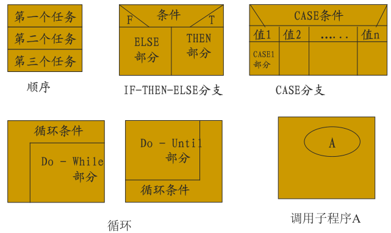

#### PAD 图

语法标准：

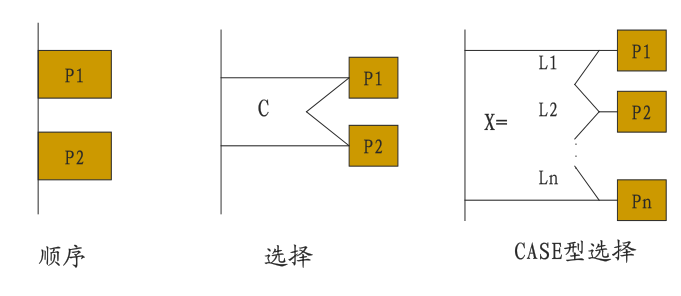

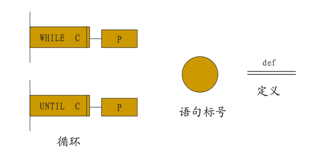

## 五 代码设计

### 设计可靠代码的方法

#### 契约式设计

分为 **异常方式** 和 **断言方式**。

- 异常方式
  - 通过抛出异常，进入提前写好的异常处理代码来解决错误。
- 断言方式
  - 通过在代码中插入断言，使得错误的条件不可能发生。

### 模型辅助设计

#### 使用决策表辅助设计

决策表是一张记录 **规则——条件** 和 **行动**的表。

例：

| 条件和行动 | 规则1 | 规则2 | 规则X |
| ---------- | ----- | ----- | ----- |
| 条件A      | ...   | ...   | ...   |
| 行动X      | X     |       |       |
| 行动Y      |       | X     | X     |

#### 使用伪代码辅助设计

略

### 单元测试用例开发

开发单元测试用例主要使用两种线索：

- 方法的规格
  - 使用基于规格的测试技术（黑盒测试）。
- 方法的逻辑结构
  - 使用基于代码的测试技术（路径覆盖、分支覆盖、语句覆盖）。

## 六 软件测试

### 测试完备性

“测试完备性”是指 测试用例能够充分覆盖软件的所有功能、性能、安全等需求，以确保软件质量达到预期的水平。

### 动态测试方法（黑盒/白盒测试法）

- 黑盒测试法
  - 属于功能测试。
  - 将测试对象视为一个黑盒，完全根据输入和输出的数据来判断测试对象的正确性。
  - 包含等价类划分、边界值分析、基于决策表的测试和基于状态转换的方法。
- 白盒测试法
  - 属于结构测试。
  - 将测试对象看作透明，按照程序结构设计测试用例。
  - 分为语句覆盖（每一行程序代码都被覆盖一次）、条件覆盖（程序中每个判断的每个结果都被覆盖一次）和路径覆盖（程序中每条独立的执行路径都被覆盖一次）。

#### 等价类划分

等价类是指某个输入域的子集合——在同一个子集合中，所有的数据对于 揭露程序中的错误 都是等效的。

- 有效等价类：对于程序的规格说明来说是合理的、有意义的输入数据构成的集合。
  - 用于检验程序是否正确实现了说明中规定的功能。
- 无效等价类：对于程序的规格说明来说是不合理的、没有意义的数据构成的集合。
  - 用于检测程序是否规避了错误和异常。

#### 边界值分析

是对于等价类划分方法的补充——经验表明错误更容易发生在等价类的边界而不是内部。

#### 基于决策表的测试

用于测试 **以复杂逻辑判断** 为规格的测试对象。

- 能保证测试的完备性，并保证成本最小。
- 决策表的每一列规则都是一个等价类。

#### 基于状态转换的测试

- 针对复杂对象——对于输入数据的反应是多样的。
- 需要先为对象建立状态图，描述测试对象的状态集合、输入集合和输入导致的状态转换集合；再以状态图为基础建立状态转换表。
- 状态转换表的每一行都应该是一个测试用例。

### 测试用例的设计

#### 逻辑覆盖

逻辑覆盖包含如下几种覆盖：

- 语句覆盖
  - 所有语句至少被执行一次。
- 判定覆盖：
  - 所有语句至少被执行一次。
  - 每个判定的每个可能结果都执行一次。
    - 注意此处：和判定的内容（符合条件等）无关，只和判定的结果有关。（区别于条件覆盖）
- 条件覆盖：
  - 所有语句至少被执行一次。
  - 每个判定表达式中的 **每个条件的** **所有可能的结果** 都被取到至少一次。
- 判定/条件覆盖 **(DC/CC)**：
  - 判定表达式中的每个条件的所有可能结果都被取到至少一次。
  - 每个判定中至少有一个条件取真，一个条件取假。
- 条件组合覆盖：
  - 每个判定表达式中所有条件的可能结果组合都至少出现一次。
- 路径覆盖：
  - 程序中的每条可能路径都至少执行一次；
  - 如果存在环，则每个环至少经过一次。
- **修改条件/判定覆盖(MC/DC)**：
  - 每个判定表达式的可能结果都被取到至少一次。
  - 每个判定中所有条件的所有可能结果都至少被取到一次。
  - *比DC/CC要严格，是最严格的覆盖标准*。

## 七 软件维护

### 软件维护的类型

软件维护通常分为下列几种维护：

- 完善性维护：为了满足新的需求、增加软件功能进行的修改。
- 适应性维护：为了使软件能够适应新的环境进行的软件修改。
- 修正性维护：为了排除软件中遗留的缺陷而进行的修改。
- 预防性维护：为了提升软件产品的可维护性而进行的修改。

### 软件的演化生命周期模型

软件的演化生命周期一般包含如下几个部分：

- 初始开发
  - 按照传统的软件开发方式完成第一个版本的软件产品开发。
  - 在此阶段应该建立一个好的软件体系结构。
    - 可扩展性、可修改性、健壮性...
- 演化
  - 该阶段的任务：
    - 预先安排的需求增量
    - 处理变更的请求
    - 修正已有的缺陷
    - 新增加的需求
  - 软件处于演化阶段的前提：
    - 软件具有较好的可演化性。
    - 软件能够帮助用户实现较好的业务价值。
- 服务
  - 该阶段的任务只包括周期性的修正已有的缺陷。
  - 进入服务阶段可能是因为无法继续演化，也可能是因为市场考虑而终止演化。
- 淘汰
  - 不再提供软件产品的任何服务和维护。
- 停止
  - 退出使用状态。

:::danger 注意

**演化生命周期模型** 和 **生命周期模型** 是不同的概念！

:::

### 软件的维护和演化技术

#### 遗留软件问题

- 如果遗留软件已经没有使用价值，则直接丢弃该软件。
- 如果仍有使用价值，则按照维护成本的开发成本进行讨论。
  - 如果维护的成本高于新开发软件的成本，则冻结遗留软件，将其作为新系统的组成部分使用。
  - 如果维护的成本高于新开发软件的成本且该软件仍具有一定的可维护性，则逆向工程该软件并继续维护该软件一段时间。
  - 如果维护的成本高于新开发软件的成本且该软件不再具备可维护性，则对其进行再工程并维护再造后的系统。

#### 逆向工程

逆向工程的基本原理是：

- 抽取软件系统的需求与设计而隐藏实现细节
- 在需求和设计的层次上描述软件系统
- 建立对系统更加准确和清晰的理解

常见的逆向工程应用：

- 识别可复用资产
- 在程序中寻找对象
- 发现软件体系结构
- 检测重复冗余
- **将二进制程序转换为源代码**
- 重写GUI
- ...

#### 再工程

再工程的目的是对遗留软件进行分析和重新开发，以利用新技术改善系统 / 促进现存系统的再利用。

定义为“检查和再造一个目标系统，用新的模式和实现复原该系统。”

常见的再工程活动：

- 重新文档化
- 重组系统结构
- 更换系统的编程语言
- 修改数据结构

::: note 逆向工程和再工程的关系

遗留软件通过 **逆向工程** 获得抽象层次的 **系统理解** 后，通过 **再工程** 对该系统进行 **重新设计、调整和增强**，再通过正向工程获得再工程后的系统。

:::

## 八 面向对象的需求分析

### 面向对象的分析方法

面向对象的分析方法认为：

- 系统是对象的集合。
- 对象之间相互协作，完成系统的任务。

面向对象需求分析的优点：

- 对于人来说比较自然、直观。
- 和结构化分析方法相比，更容易实现从分析到设计的转化。

### UML 需求建模

#### 用例、用例描述

用例：“在系统和外部对象的交互中所执行的行为序列的描述，包括各种序列和错误的序列，它们联合起来提供一种有价值的服务”。

一个用例是相关场景的集合。

例：一个超市中“销售处理”用例可能会包含以下情景：

- 一切顺利
- 在买多个同样商品时，既可以逐个输入商品，也可以分别输入商品号和数量。
- 可能会出现某个商品无法识别。
- 用户可能会在商品纳入销售清单后又退回商品。

#### 用例图

用例图是系统所有用例的集合。

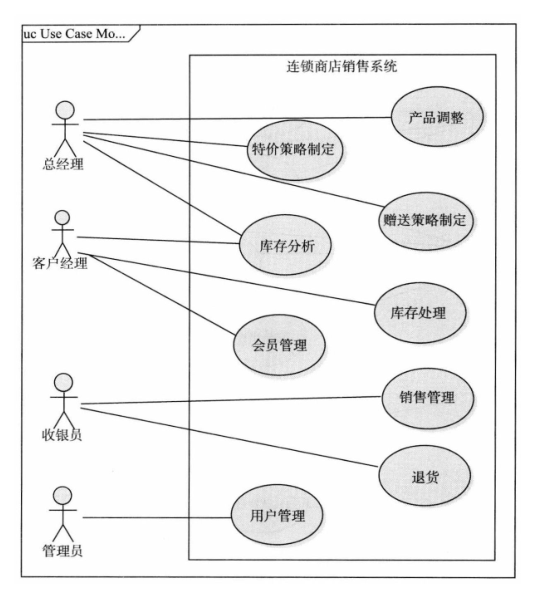

用例图包含以下四个基本元素：

- 用例：表示为一个水平的椭圆。
- 参与者：发起 / 参与用力的外部用户/其他软件系统，表示为一个小人。
  - 代表的是 **和系统进行交互的一个角色**， 而不是一个人 / 一个工作职位。
- 关系
- 系统边界：表示为一个矩形框。

可以按照下列步骤建立用例图：

- 目标分析，确定解决方向
- 寻找参与者
- 寻找用例
  - 每个 **参与者** 的一个 **目标 / 任务** 就是一个系统用例。
- 细化用例
  - 细化的标准是：一个用例描述为了应对一个业务事件，由一个用户发起，并在一个连续时间段内完成的，**有业务价值的**任务。

::: warning 细化用例的误区

- 不要将同一个目标细化为不同用例（如“折扣”和“赠送”）。
- 不要将没有业务价值的内容作为用例（如“登录”，“数据验证”，“连接数据库”等）。

:::

#### 概念类图（领域模型）

UML中的概念类图是面向对象分析方法的核心。

类型、方法、可见性等软件细节不会出现在概念类图中。

概念类图的基本元素如下：

- 对象；包含
  - 表示符：唯一标识、识别对象的符号。一般使用 **对象的引用**。
  - 状态：对对象特征的描述，包括属性、取值等。
  - 行为：描述对象在状态发生改变/接收到外界消息时所采取的行动。
    - 行为是基于状态的；多个行为之间往往具有相关性。
- 类
  - 是共享相同属性和行为的对象的集合。
  - 包含唯一标识名称、属性和行为方法。
  - 概念类图中的类大多是概念类（代表现实世界事物的概念），通常没有类型约束，也不会包含明确的方法。
- 链接
  - 表示对象之间相互协作的关系。
  - 可以是单向/双向的。
- 关联
  - 表示类之间的**语义联系**。
  - 是对对象之间链接的抽象。
  - 包含名称和多个终端，每个终端包含 角色 和 基数特征。
  - 存在特殊的关联——聚合，表示部分和整体之间的关系；通过在“整体”一段添加一个空心菱形表示。
  - 如果除聚合关系意外还存在依赖关系（脱离整体无法单独存在），则为组合关系，用实心菱形表示。
- 继承
  - 如果类A集成自类B，则A具有B的所有属性和服务；此外A还会存在一些自己特有的属性和服务。
  - 称A为B的 **特化**。

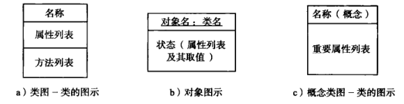

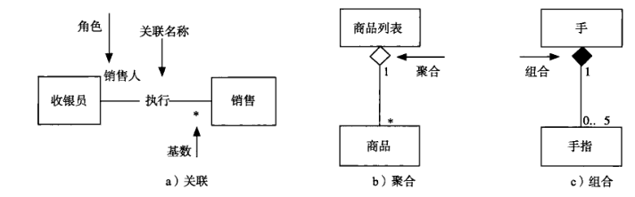

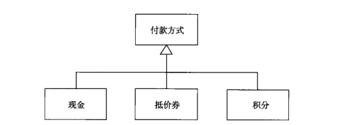

建立概念类图的流程：

- 对每个用例的文本描述建立局部的概念类图。
  - 识别、筛选候选类，并确定概念类
    - 标准：该类对象实例的状态和行为是否全部必要。
      - 如果需要维护状态和行为：是概念类
      - 如果只需要维护状态：其他概念类的属性
      - 如果不需要维护状态，需要表现行为：删除候选类，将行为转交其他概念类
      - 其他类型剔除。
  - 识别关联
  - 识别重要属性
- 将局部概念类图合并。

#### 顺序图（交互图）

顺序图是交互图的一种，用来表示对象的协作。

顺序图中，纵轴表示时间轴（向下延伸），横轴表示参与协作的对象。对象之间的消息在图上从上到下排列。

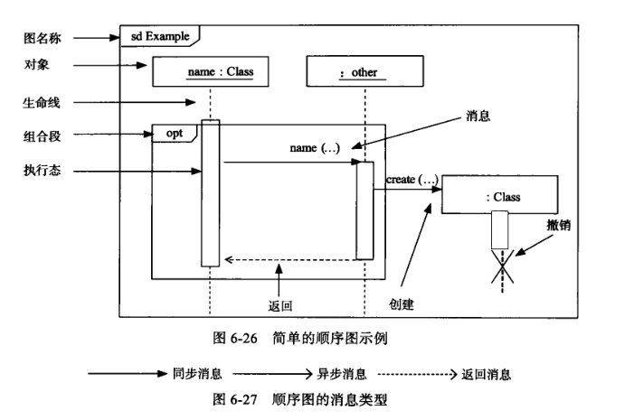

系统顺序图是顺序图的一种，它将整个系统看作一个黑箱，强调外部参与者和系统的交互行为，重点展示系统级事件。

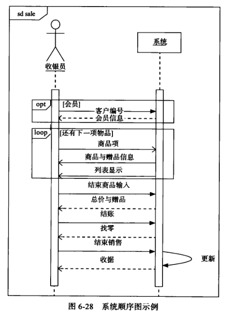

#### 状态图

状态图的基础元素包括：

- 状态
- 开始状态
- 结束状态
- 事件
- 监护条件
- 活动
- 转换

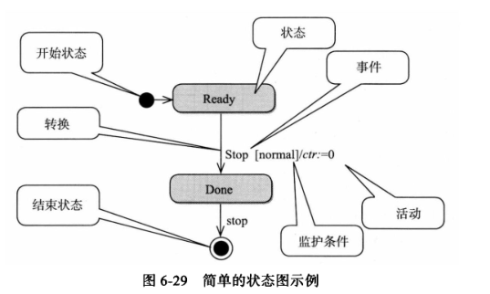

状态图的建立包括以下步骤：

- 确定上下文环境
- 识别状态
- 建立状态转换表
- 补充详细信息（触发事件、转换行为、监护条件等）

## 九 面向对象的设计

### 软件体系结构、部件、连接件和配置

软件体系结构通常定义为 一个软件的 **部件，连接件和配置**。

- 部件
  - 基本组成单位，承载主要功能
  - 分为原始和复合部件。
  - 复合部件由更细的部件和连接件组成。
- 连接件
  - 定义部件之间的交互，是连接的抽象
  - 也分为原始和复合连接件
- 配置：对形式的发展，定义了部件和连接件之间的关联方式。

#### 体系结构抽象与实现

**以部件、连接件和配置（不依赖于编程机制）为基本单位** 组织的模型就是软件体系结构的抽象，目的是描述软件系统的整体功能组织。

**用编程语言实现的模块、构件、进程等（依赖于编程机制的）传统单位** 组成的模型就是软件体系结构的实现。

#### 体系结构风格

体系结构风格有如下几种：

- 主程序/子程序风格
  - 结构
    - 由一个主程序和数个子程序组成多层次结构
    - 主程序负责调度所有子程序的执行
    - 子程序又是下一层子程序的控制器
  - 约束
    - 上层部件可以使用下层部件，但下层部件不能使用上层部件
    - 系统为单线程执行
    - 子程序只能通过上层转移获得控制权
  - 优缺点
    - 流程清晰易于理解
    - 控制性强
    - 耦合性强（程序调用）
    - 连接方式限制了数据交互，可能产生公共耦合
  - 应用
    - 能将系统功能分解为多个顺序执行步骤的系统
- 面向对象式风格
  - 结构
    - 将系统组织为多个独立的对象
    - 每个对象封装内部的数据，并基于数据向外提供服务
    - 对象之间通过协作完成任务
  - 约束
    - 略
  - 优缺点
    - 内部实现可修改
    - 易于开发、理解、复用
    - 接口耦合（方法调用连接机制）
    - 标识耦合（要和对象交互必须先知道标识）
    - 面向对象的其他副作用
  - 应用
    - 基于数据信息分解和组织的软件系统
- 分层式风格
  - 结构
    - 根据不同的抽象层次，将系统组织为层次式结构。
    - 每个层次一个部件
    - 部件之间使用程序调用进行连接
  - 约束
    - 从低到高抽象程度递增
    - 两个层次之间的连接要遵守特定的交互协议
    - 禁止跨层次连接、逆向连接
  - 优缺点
    - 机制清晰易于理解
    - 支持并行开发
    - 可复用、内部可修改
    - 交互协议难以修改
    - 性能损失（沿层次依次调用）
    - 难以确定层次数量
  - 应用
    - 没有实时性要求
    - 需要并行开发
- 模型-视图-控制(MVC)风格
  - 结构
    - 模型：封装系统的数据和状态信息，提供业务逻辑和数据服务
    - 视图：封装用户交互，接受用户行为，提供业务展现
    - 控制：封装系统控制逻辑，根据用户行为调用逻辑和数据更新
  - 约束
    - 模型、视图、控制分别是关于业务逻辑、表现、控制的三种内容抽象
    - 如果视图要持续显示数据，则需要现在模型中注册对该数据的兴趣；该数据的变化由模型通知视图。
    - 视图只能使用模型的数据查询服务
    - 只有控制部件可以修改模型状态
    - 用户行为由视图发起，交控制部件处理
    - 模型部件相对独立
  - 优缺点
    - 易于开发
    - 视图、控制易于修改
    - **适用于网络系统开发**
    - 结构复杂
    - 模型修改困难

#### 体系结构设计过程、原型构建

体系结构的设计过程：

- 分析关键需求和项目约束
  - 输入要素
    - 软件需求规格说明
    - 项目约束（开发团队、预算、...）
- 选择体系结构风格
- 进行软件体系结构的逻辑设计
  - 依据 **概要功能需求** 和 **体系结构风格** **建立初始设计**
  - 使用 **非功能性需求** 和 **项目约束** 来 **评价和改进** 初始设计
- 依据逻辑设计进行软件体系结构的物理设计
  - 构件 / 开发包设计
  - 运行时的进程
  - 物理部署
- 完善和细化软件体系结构设计
- 定义构件接口
- 迭代过程3~6

### 详细设计方法

#### 面向对象的设计方法

面向对象设计分为以下过程：

- 建立设计模型
  - **职责与静态模型**
    - 确定抽象类的职责
      - 主要有两种职责：属性职责（状态）和方法职责（行为）
    - 确定抽象类之间的关系
      - 关系由弱到强分别为：依赖、关联、聚合、组合、继承
    - 添加辅助类
  - **协作与动态模型**
    - 抽象对象之间的协作
      - 两种方法：从小职责聚合成大职责、将大职责分配给小对象
    - 明确对象的创建
      - 由哪个对象，在什么时间、什么地点创建？
      - 依据优先级决定（从高到低）
        - 存在组合关系（参与组成系统）
        - 被单向关联（被管理）
        - 所需要的数据被某个对象持有
        - 被某个对象整体包含
        - ...
    - 选择合适的控制风格
      - 集中式、委托式、分散式——复杂度从高到低
- 设计模型重构

#### 面向对象方法下的模块化

- 模块化
  - 将软件划分为独立命名、可独立访问的，被称为模块的构件。
  - 每个模块完成一个子功能。
  - 所有的模块集成到一起能够满足问题的需求。
- 实现模块化的手段
  - 抽象：抽出事物的本质特性而暂时不考虑细节。
  - 信息隐蔽：在设计模块时，一个模块内包含的信息对于不需要这些信息的模块是不可访问的。
  - 模块独立性：应当开发具有独立功能、和其它模块之间没有过多的相互作用的模块。
  - 内聚性：一个模块内各个元素彼此结合的紧密程度。
    - 理想状态下的内聚模块应该只做一件事情。
  - 耦合性：一个软件结构内不同模块之间互联程度的度量。
  - **软件设计时需要尽可能地实现低耦合，高内聚。**
- 模块独立的意义：
  - 功能分割，简化接口，易于多人合作开发同一款软件。
  - 独立的模块更容易进行测试和维护。

::: note 耦合的类型

- 无连接：两个模块都能独立工作而不依靠另一方：最低程度的耦合。
- 数据耦合：两个模块通过参数交换信息，仅交换数据：耦合程度较低。
- 控制耦合：两个模块之间传递的信息含有控制信息（开关、标志等）：耦合程度中等。
- 公共环境耦合：两个及以上模块通过一个公共环境相互作用（全局变量等）：耦合程度中等。
- 内容耦合：耦合程度高。
  - 互相访问内部数据；
  - 有部分代码重叠；
  - 能够不通过正常入口转移到其他模块内部 （goto 等）
  - 有多个入口（意味着 **有多个功能**）。

:::

::: note 内聚的类型

- 偶然内聚：一组任务仅仅是被放在了一起，没有任何关联。内聚性低。
- 逻辑内聚：一组任务在逻辑上属于同一类（输出、输入等）。内聚性低。
- 时间内据：一组任务必须在同一段时间内执行。内聚性低。
- 信息内聚：模块内所有元素都需要引用相同的输入/输出数据集合。内聚性中等。
- 顺序内聚：模块中的每个元素都和同一个功能紧密相关，且 **一个元素的输出是下一个元素的输入**。内聚性高。
- 功能内聚：一个模块完成一个且仅完成一个功能。内聚性高。

:::

#### 面向对象方法下的信息隐藏

- 职责和封装
  - 职责：类维护一定的状态信息，并基于状态旅行行为职能的能力。
  - 封装：将数据和行为同时包含在类中，并将内部实现和对外接口分离。
  - 在面向对象方法中，类的封装需要封装出了接口之外的所有实现细节（包括数据、属性等）。
- 为变更而设计
  - 封装变更 / 开闭原则：好的设计应该对扩展开放，对修改关闭。
  - 多态：不同类型的值通过统一的接口操纵。（弱类型语言天生是多态的。）
  - 依赖倒置原则：
    - 稳定的抽象不应该依赖于不稳定的细节，细节应该依赖于抽象。
    - 高层模块不应该依赖于底层模块，而是双方都依赖于抽象。
    - 例：如B依赖于具体模块A，则可抽象出接口IA，实现B依赖于IA，A实现IA的合理依赖关系。

#### 设计模式

- 可修改性
  - 对已有实现的修改
  - 可扩展性
  - 灵活性（实现的动态配置）

有如下几种常用的设计模式：

- 策略模式
  - 需求：
    - 有些行为可以分为很多种方式进行，人们往往会将这种行为独立成为一个策略；
    - 单独一个策略类可能不足以满足行为的复杂实现，则需要使用策略模式。
  - 结构：
    - 上下文包含策略类；
    - 策略类包含策略接口，具体策略类实现策略接口。
  - 应用场景
    - 很多相关类只在行为的实现上不同 / 需要同一个行为的不同实现
    - 算法需要用到不应该被客户知道的数据
- 抽象工厂模式
  - 略
- 单件模式
  - 只希望内存中存在一个该类的对象
- 迭代器模式
  - 略

## 十 软件开发过程模型

### 软件生命周期模型

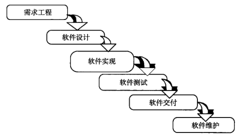

### 软件过程模型

- 构建-修复模型
  - 缺点
    - 没有质量保证
    - 随着开发，开发活动会超出个人的控制能力
    - 不考虑软件结构的质量，软件质量会逐渐下降
    - 没有文档和测试，维护困难
- 瀑布模型
  - 约束
    - 按照软件生命周期模型将开发组织为不同活动，活动之间自上而下相互衔接。
    - 某些活动可以反复迭代。
  - 缺点
    - 过度依赖文档
    - 假设开发过程是线性的
    - 客户、用户参与度不够
- 增量迭代模型
  - 约束
    - 将开发活动组织成多个迭代、并行的瀑布式开发活动。
    - 需要在早期就确定项目的目标和范围。
    - 每个迭代的需求相对独立。
  - 优点
    - 适用性好
    - 缩短开发时间
    - 加强用户反馈（渐进交付）
  - 缺点
    - 需要软件具备开放式的体系结构。
    - 需要一个完备、清晰的项目前景和范围来规划。
- 演化模型
  - 约束
    - 将开发活动组织成多个迭代、并行的瀑布式开发活动。
    - 每一次开发得到核心系统后，将用户使用中对于需求的反馈发送给开发人员来进行后续迭代。
  - 优点
    - 适用性高
    - 缩短开发时间
    - 加强用户反馈（渐进交付）
  - 缺点
    - 无法在早期阶段确定范围
    - 后续开发在前导工作基础上扩展，容易让后续开发退化成构建-修复方式。
  - 适用领域：不稳定领域的大规模软件开发
- 原型模型
  - 约束
    - 将开发活动展开为抛弃式原型开发的迭代，**用于解决新颖领域需求不确定的问题**。
    - 在解决需求不确定问题后，转为瀑布式开发。
  - 优缺点同演化模型。
- 螺旋模型
  - 方法
    - 确定目标、解决方案和约束—评估方案，发现风险-寻找风险解决办法-落实风险解决-下一个迭代
    - 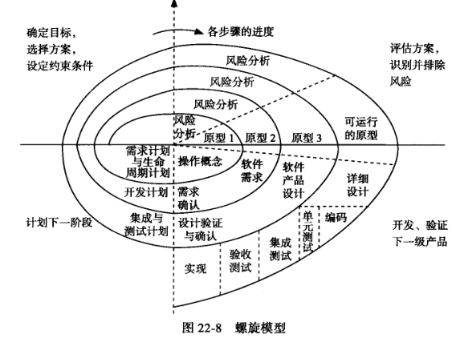
  - 优点：降低风险
  - 缺点：
    - 风险解决需要使用原型，存在原型带来的风险
    - 模型过于复杂
  - 应用：高风险的大规模软件系统开发
- Rational 统一过程
  - 约束：
    - 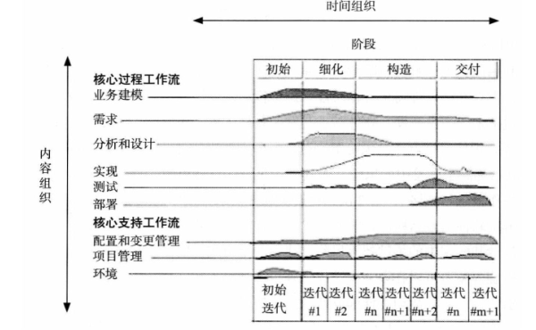
  - 核心方法：
    - 迭代式开发
    - 管理需求
    - 基于组件的体系结构
    - 可视化建模
    - 验证软件质量
    - 控制软件变更
  - RUP裁剪
    - 确定项目需要的工作流
    - 确定每个工作流需要的制品
    - 确定阶段之间的演进
    - 确定阶段内的迭代计划
    - 规划工作流的组织
  - 优点
    - 保证开发过程基本有效、合理
    - 适用面广泛
    - 有一套软件工程工具的支持
  - 缺点
    - 没有考虑软件维护问题
    - 无法保证每个项目都能定制一个有效的RUP
- 敏捷过程
  - 约束
    - 敏捷思想和原则
      - 个体和互动 高于 流程和工具
      - 工作的软件 高于 详尽的文档
      - 客户合作 高于 合同谈判
      - 响应变化 高于 遵守计划
    - 极限编程
      - 极限利用简单有效的方法解决问题
      - 如果xx好用，就一直做xx
